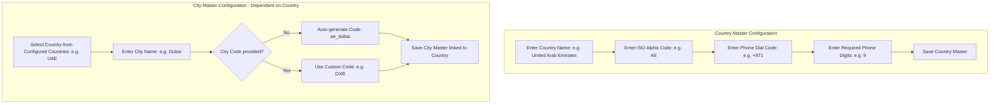
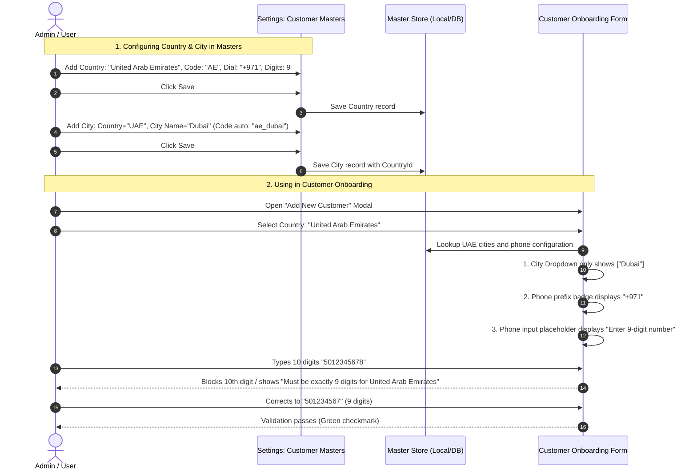

# Customer Masters: Country, City & Phone Validation Architecture Logic

## 1. User Prompts & Objectives

### 1.1 User Questions & Requirements
> **Prompt 1:** *"okay for master customer county and cities are dependend write?"*  
> **Prompt 2:** *"and code for citiy is needed?"*  
> **Prompt 3:** *"and also in country code and their phone number starting country code and how many digits number should be provided that validation is allso important"*

### 1.2 Core Objectives
1. **Country &rarr; City Cascading Dependency:**
   - In **Settings &rarr; Masters &rarr; Customer Masters**, establishing a strict parent-child relationship where Cities belong directly to Countries.
   - When configuring a City, the user must select which Country it belongs to.
   - In Customer Onboarding, selecting a Country strictly filters the City dropdown to only the cities belonging to that selected Country.
2. **City Code Auto-Generation & Customization:**
   - Database integrity requires a unique `Code` for every city (`mst_cities.Code`).
   - The UI auto-generates this code (e.g. `in_pune`, `ae_dubai`, `us_new_york`), keeping manual input optional while allowing custom IATA codes (e.g. `PUN`, `DXB`, `NYC`).
3. **Country International Dial Code (`PhoneCode`) & Phone Digits (`PhoneDigits`) Validation:**
   - When configuring Countries in Customer Masters, define:
     - **Phone Dial Code** (e.g. `+91`, `+1`, `+971`, `+44`, `+65`).
     - **Exact Phone Digits Count** (e.g. `10` for India/US, `9` for UAE/Australia, `8` for Singapore, `11` for Germany).
   - In Customer Onboarding (`enhanced-customer-modal.tsx` & `customers.index.tsx`):
     - Selecting a Country dynamically switches the phone number prefix badge to that country's dial code.
     - Automatically limits and validates the phone input to the exact number of digits configured for that country.
4. **Save-Gated Publishing:**
   - Changes and additions made in Customer Masters only reflect in Customer Onboarding once explicitly saved.

---

## 2. Field Specifications & Database Mapping

### 2.1 Database Schema Reference (`mst_countries` & `mst_cities`)

```sql
-- Countries Table
CREATE TABLE mst_countries (
    "Id" uuid PRIMARY KEY,
    "Code" varchar(10) NOT NULL UNIQUE,       -- ISO Alpha (e.g. 'IN', 'US', 'AE')
    "Name" varchar(100) NOT NULL UNIQUE,      -- Name (e.g. 'India', 'United Arab Emirates')
    "PhoneCode" varchar(10) NOT NULL,         -- Dial Prefix (e.g. '+91', '+1', '+971')
    "PhoneDigits" integer NOT NULL DEFAULT 10 -- Expected Phone Digits (e.g. 10, 9, 8)
);

-- Cities Table (Dependent on Country)
CREATE TABLE mst_cities (
    "Id" uuid PRIMARY KEY,
    "Code" varchar(50) NOT NULL UNIQUE,       -- City Code (e.g. 'in_pune', 'ae_dubai')
    "Name" varchar(100) NOT NULL,             -- City Name (e.g. 'Pune', 'Dubai')
    "CountryId" uuid NOT NULL,                -- Foreign Key to mst_countries
    CONSTRAINT "FK_mst_cities_mst_countries" FOREIGN KEY ("CountryId") REFERENCES mst_countries ("Id"),
    CONSTRAINT "IX_mst_cities_CountryId_Name" UNIQUE ("CountryId", "Name")
);
```

### 2.2 Global Standard Matrix

| Country | ISO Code (`Code`) | Dial Code (`PhoneCode`) | Phone Digits (`PhoneDigits`) | Example Cities | Example City Codes |
|---|---|---|---|---|---|
| **India** | `IN` | `+91` | **10** | Pune, Mumbai, Bengaluru, Delhi | `in_pune`, `in_mumbai`, `in_blr` |
| **United States** | `US` | `+1` | **10** | New York, San Francisco, Austin | `us_new_york`, `us_sf`, `us_austin` |
| **United Arab Emirates** | `AE` | `+971` | **9** | Dubai, Abu Dhabi, Sharjah | `ae_dubai`, `ae_abu_dhabi` |
| **United Kingdom** | `GB` | `+44` | **10** | London, Manchester, Edinburgh | `gb_london`, `gb_manchester` |
| **Singapore** | `SG` | `+65` | **8** | Singapore | `sg_singapore` |
| **Germany** | `DE` | `+49` | **11** | Berlin, Munich, Frankfurt | `de_berlin`, `de_munich` |
| **Australia** | `AU` | `+61` | **9** | Sydney, Melbourne, Brisbane | `au_sydney`, `au_melbourne` |
| **Canada** | `CA` | `+1` | **10** | Toronto, Vancouver, Montreal | `ca_toronto`, `ca_vancouver` |

---

## 3. Customer Masters Configuration Logic (Settings Module)



### 3.1 Country Master Form Fields
When an admin navigates to **Settings &rarr; Masters &rarr; Customer Masters &rarr; Countries**:
- **Country Name** (`text`, Required): e.g. `United Arab Emirates`
- **ISO Alpha Code** (`text`, Required, 2-3 characters): e.g. `AE`
- **Phone Dial Code** (`text`, Required, starts with `+`): e.g. `+971`
- **Phone Digits Count** (`number`, Required, between 7 and 15): e.g. `9`

### 3.2 City Master Form Fields (Dependent on Country)
When an admin navigates to **Settings &rarr; Masters &rarr; Customer Masters &rarr; Cities**:
- **Country** (`dropdown`, Required): Select from active countries in Country Master.
- **City Name** (`text`, Required): e.g. `Dubai`
- **City Code** (`text`, Optional / Auto-generated):
  - If left blank, automatically derives:
    ```typescript
    const defaultCode = `${countryCode.toLowerCase()}_${cityName.toLowerCase().replace(/[^a-z0-9]/g, '_')}`;
    ```
  - User can override with custom abbreviations (e.g. `DXB`, `PUN`, `BOM`).

---

## 4. Customer Onboarding Form Integration (`enhanced-customer-modal.tsx` & `customers.index.tsx`)

### 4.1 Country &rarr; City Cascading Dropdown Logic
```typescript
// 1. User selects a Country
const handleCountryChange = (selectedCountryName: string) => {
  setFormData(prev => ({
    ...prev,
    country: selectedCountryName,
    city: "", // Clear previously selected city immediately
    phoneNumber: "", // Reset phone to avoid digit mismatch
  }));

  // 2. Filter available cities by selected country
  const matchingCountry = countries.find(c => c.name === selectedCountryName);
  if (matchingCountry) {
    const countryCities = allCities.filter(city => city.countryId === matchingCountry.id || city.countryCode === matchingCountry.code);
    setFilteredCities(countryCities);
  } else {
    setFilteredCities([]);
  }
};
```

### 4.2 Dynamic Phone Dial Code & Digit Validation Logic
```typescript
// 1. Resolve active country rules
const selectedCountryObj = countries.find((c) => c.name === formData.country);
const countryDialCode = selectedCountryObj?.phoneCode || "+91";
const countryPhoneDigits = selectedCountryObj?.phoneDigits || 10;

// 2. Strict digit validation function
const validatePhoneNumber = (phone: string, countryName: string): string | null => {
  if (!phone.trim()) return "Group SPOC Contact is required";
  
  // Strip non-digits
  const cleanDigits = phone.replace(/\D/g, "");
  
  if (cleanDigits.length !== countryPhoneDigits) {
    return `Must be exactly ${countryPhoneDigits} digits for ${countryName || "selected country"} (currently entered ${cleanDigits.length} digits)`;
  }
  
  return null; // Valid
};

// 3. Input formatting and restriction
const handlePhoneInput = (e: React.ChangeEvent<HTMLInputElement>) => {
  // Only allow numbers and clamp to exact max length
  const digitsOnly = e.target.value.replace(/\D/g, "").slice(0, countryPhoneDigits);
  setFormData(prev => ({ ...prev, phoneNumber: digitsOnly }));
};
```

---

## 5. End-to-End User Experience & Flow



---

## 6. Implementation Checklist

- [ ] **Step 1: Update Customer Master Types (`types.ts`)**
  - Add `phoneCode` (string) and `phoneDigits` (number) to Country Master items.
  - Add `countryId` (string) and `countryCode` (string) to City Master items.
- [ ] **Step 2: Update Customer Masters UI (`customer-masters-section.tsx`)**
  - Add `Phone Dial Code` and `Phone Digits` inputs when adding/editing a Country.
  - Add `Country` select dropdown when adding/editing a City.
  - Auto-generate City Code from Country Code + City Name with option to override.
  - Display Country badge next to City in the Masters table and allow filtering Cities by Country.
- [ ] **Step 3: Update Customer Onboarding Form (`enhanced-customer-modal.tsx` & `customers.index.tsx`)**
  - Dynamically load `phoneCode` and `phoneDigits` from the selected Country master.
  - Dynamically update Phone prefix badge and enforce `maxLength={countryPhoneDigits}`.
  - Filter City dropdown strictly by selected Country.
- [ ] **Step 4: Quality & Validation Testing**
  - Verify India enforces `+91` and exactly 10 digits.
  - Verify UAE enforces `+971` and exactly 9 digits.
  - Verify Singapore enforces `+65` and exactly 8 digits.
  - Verify changing Country clears the City field and recalculates phone validation instantly.
