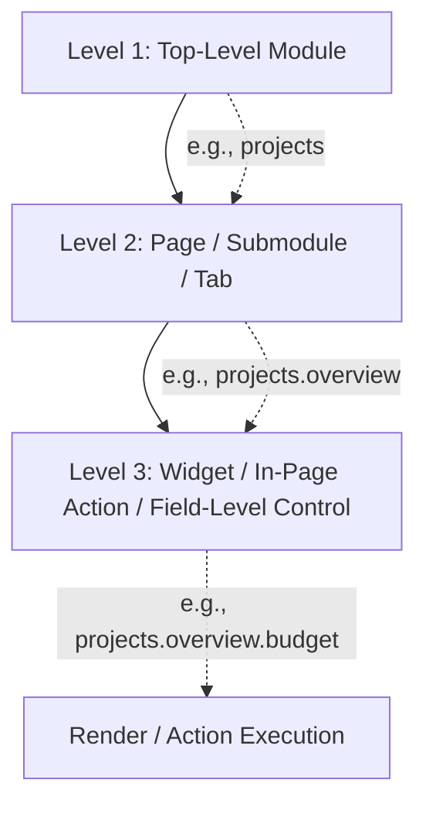
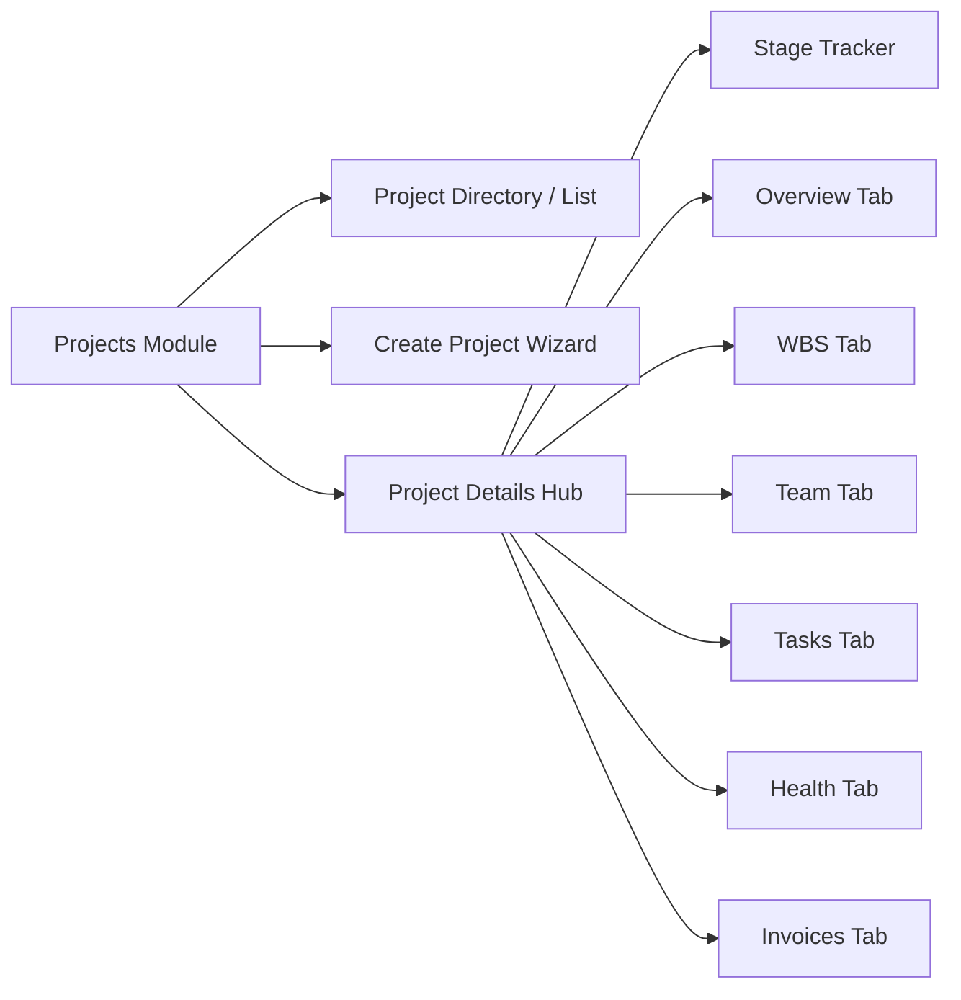

# TrackerPro / Pulse PMO: Complete Module-Wise Access & Widget-Level RBAC Specification

> **Document Version:** 2.0  
> **Target Audience:** System Administrators, Security Officers, Product Managers, and Technical Leads  
> **Status:** Active Reference Specification  

---

## 1. Executive Summary & RBAC Architecture

TrackerPro uses a granular **3-Level Hierarchical Role-Based Access Control (RBAC)** architecture that governs visibility and operational capabilities across all modules, pages, tabs, widgets, and in-page actions.

### 1.1 Permission Key Naming Standard
Every grantable privilege is identified by a canonical dot-notation string:
$$\text{Permission Key} = \mathbf{\langle module \rangle} \,.\, \mathbf{\langle submodule\_or\_page \rangle} \,.\, \mathbf{\langle widget\_or\_action \rangle}$$

*Examples:*
- `projects.overview.budget` $\rightarrow$ Project details $\rightarrow$ Overview tab $\rightarrow$ Budget & Financials card
- `resources.directory.full-columns` $\rightarrow$ Resources $\rightarrow$ Employee directory $\rightarrow$ CTC & Bank details columns
- `action-center.approvals.act` $\rightarrow$ Action Centre $\rightarrow$ Approvals tab $\rightarrow$ Approve/Reject buttons

---

## 2. Complete Module-Wise Access Hierarchy

---

### Module 1: Dashboard (`/`)

The central command dashboard provides a high-level operational overview customized to the logged-in role.

| Level | Component / Item | Canonical Permission Key | Description & Target Widgets |
| :--- | :--- | :--- | :--- |
| **Module** | **Dashboard** | `dashboard.view` | Controls access to the `/` root route and sidebar icon. |
| **Widget** | **Statistics Summary Cards** | `dashboard.stats` | • **Active Projects Count** • **Open Critical Issues Count** • **Pending Timesheets Count** • **Bench Resources Count** |
| **Widget** | **KPI & Velocity Metrics** | `dashboard.kpi` | Delivery health gauge, milestone completion rate, billable utilization %. |
| **Widget** | **Recent Activity Stream** | `dashboard.activity` | Live feed of recent project updates, stage transitions, and approvals. |
| **Widget** | **Projects at a Glance** | `dashboard.view` | Quick access project table filtered by user role scope. |

#### Role Access Recommendations for Dashboard:
- **Full View (`stats`, `kpi`, `activity`):** Admin, PMO, Business Owner, HOD, Senior PM, PM, Engagement Manager, Accounts, Sales.
- **Assigned-Only View:** Employee, Team Lead.
- **Restricted / Hidden:** HR (HR lands directly in Employee Directory).

---

### Module 2: Action Centre (`/action-centre`)

A unified inbox for daily tasks, approvals, active risk alerts, and operational notifications.

| Level | Component / Submodule | Canonical Permission Key | In-Page Widgets & Actions |
| :--- | :--- | :--- | :--- |
| **Module** | **Action Centre** | `action-center.view` | Access to `/action-centre` hub and navigation tab. |
| **Submodule / Tab** | **Bucket List** | `action-center.bucket-list.view` *(Alias: `action.bucket_list`)* | • Task execution list & priority filters (Urgent, High, Medium) • My Assigned Deliverables card • Today's Work Queue widget |
| **Action / Widget** | **Task Live Timer** | `action-center.bucket-list.timer` *(Alias: `action.bucket_timer`)* | • **Start / Pause Live Task Timer** button • Real-time hour logging counter widget |
| **Submodule / Tab** | **Approvals** | `action-center.approvals.view` *(Alias: `action.approvals`)* | • Pending Timesheets Queue • Client Account Approval Requests • Project Extension Requests Table |
| **Action / Widget** | **Approve / Reject Action** | `action-center.approvals.act` *(Alias: `action.acknowledge`)* | • **One-Click Approve** button • **Reject with Justification** modal • Bulk approval toolbar |
| **Submodule / Tab** | **Alerts** | `action-center.alerts.view` *(Alias: `action.alerts`)* | • Overdue milestone warning banner • Budget overrun threshold alerts • Red Health project warnings |
| **Action / Widget** | **Resolve Alert** | `action-center.alerts.resolve` | • **Acknowledge Alert** button • **Dismiss / Mark Resolved** trigger |
| **Submodule / Tab** | **Notifications** | `action-center.notifications.view` *(Alias: `action.notifications`)* | • System broadcast feed • Unread activity badges • Mark all as read button |

---

### Module 3: Projects (`/projects`)

The core project management module comprising the project directory, creation wizard, and multi-tab project detail pages.

#### 3.1 Project Directory & High-Level Actions (`/projects`)

| Level | Component | Canonical Key | Description & UI Elements |
| :--- | :--- | :--- | :--- |
| **Module** | **Projects Module** | `projects.view` | Directory table access, status pills, filter bar. |
| **Action** | **Create Project** | `projects.create` | `+ New Project` button $\rightarrow$ navigates to `/projects/new`. |
| **Action** | **Draft Projects** | `projects.drafts` | View & resume incomplete draft project proposals. |
| **Action** | **Export Projects** | `projects.export` | Export project list to CSV, Excel, or PDF. |
| **Action** | **Close / Archive Project** | `projects.close` | Move project to Completed/Archived status with audit lock. |
| **Action** | **Delete Project** | `projects.delete` | Hard delete uncommitted or cancelled projects. |

---

#### 3.2 Project Detail Sub-Pages & In-Page Widgets (`/projects/$projectId`)

##### A. Header & Stage Tracker
| Component | Canonical Key | UI Widgets & Controls |
| :--- | :--- | :--- |
| **Stage Tracker Widget** | `projects.stage-tracker.view` *(Alias: `projects.stage_tracker`)* | Interactive visual pipeline (`Intake` $\rightarrow$ `Scoping` $\rightarrow$ `Execution` $\rightarrow$ `Testing` $\rightarrow$ `Sign-Off` $\rightarrow$ `Closed`). |
| **Update Stage Progress** | `projects.stage-tracker.edit` | **Transition Stage** modal, stage gate sign-off checklist, progress slider. |

##### B. Overview Tab (`projects.overview.*`)
| Component | Canonical Key | UI Widgets & Controls |
| :--- | :--- | :--- |
| **View Overview** | `projects.overview.view` | Project summary card, client info, key dates, objectives. |
| **Edit Overview Details** | `projects.overview.edit` | Edit project name, description, tags, target delivery date. |
| **Budget & Financials Card** | `projects.overview.budget` *(Alias: `projects.budget.view`)* | **Total Budget**, **Burn Rate**, **Actual Cost**, **Variance %**, **Remaining Margin** widgets. |
| **Request Extension** | `projects.overview.extension` | **Request Timeline Extension** button & justification dialog. |
| **Change Project Manager** | `projects.overview.edit_pm` | PM assignment dropdown selector. |
| **Change Team Lead** | `projects.overview.edit_tl` | Team Lead assignment dropdown selector. |
| **Change Senior PM** | `projects.overview.edit_spm` | Senior PM oversight assignment dropdown. |
| **View Senior PM** | `projects.overview.view_spm` | Senior PM banner card visibility. |

##### C. WBS (Work Breakdown Structure) Tab (`projects.wbs.*`)
| Component | Canonical Key | UI Widgets & Controls |
| :--- | :--- | :--- |
| **View WBS** | `projects.wbs.view` | Full tree breakdown of milestones, deliverables, and service phases. |
| **PMO Intake & Workflow** | `projects.wbs.pmo_intake` | PMO validation checklist, approval gateway, prerequisite compliance gate. |
| **Services & Deliverables** | `projects.wbs.services` | Deliverable hierarchy tree, timeline Gantt view, completion status. |
| **WBS Amount & Pricing** | `projects.wbs.amount` | Individual deliverable billing values, milestone cost amounts. |
| **Resource Allocation Action** | `projects.wbs.project_allocation` | **Allocate Resource to Deliverable** button, role assignment matrix. |
| **Prerequisite Tracking** | `projects.wbs.service_prereq` | Client dependency checklist, technical blocker dependencies widget. |

##### D. Team Tab (`projects.team.*`)
| Component | Canonical Key | UI Widgets & Controls |
| :--- | :--- | :--- |
| **View Team** | `projects.team.view` | Allocated members roster, role tags, billability indicators. |
| **Assign Team Members** | `projects.team.assign` | `+ Add Team Member` modal, role picker, allocation dates. |
| **Edit Team Allocation** | `projects.team.edit` | Edit allocation % (e.g. 50% vs 100%), change active dates, unassign. |

##### E. Tasks Tab (`projects.task.*`)
| Component | Canonical Key | UI Widgets & Controls |
| :--- | :--- | :--- |
| **View Tasks** | `projects.task.view` | Kanban board / list view of sprint and backlog tasks. |
| **Create Task** | `projects.task.create` | `+ Create Task` dialog, milestone link, priority tag. |
| **Edit Task Details** | `projects.tasks.edit` | Edit task title, description, estimates, story points. |
| **Assign Task** | `projects.task.assign` | Assign task to specific team members. |
| **Update Task Status** | `projects.task.update-status` | Drag-and-drop between Kanban columns or status dropdown. |

##### F. Health & Risk Tab (`projects.health.*`)
| Component | Canonical Key | UI Widgets & Controls |
| :--- | :--- | :--- |
| **View Project Health** | `projects.health.view` | Health status indicator (🟢 Green, 🟡 Amber, 🔴 Red), health trend chart. |
| **Issues List Widget** | `projects.health.issues` | Active risks, technical blockers, customer escalations table. |
| **Raise Issue** | `projects.health.raise-issue` | `+ Raise Issue` modal (Category, Impact, Severity, Mitigation). |
| **Edit Issue Details** | `projects.health.edit-issue` | Update risk score, edit mitigation plan, reassign issue owner. |
| **Resolve Issue** | `projects.health.resolve-issue` | **Resolve / Close Issue** button with root-cause analysis logging. |
| **Health Comments** | `projects.health.comment` | Stakeholder discussion notes and governance feedback stream. |
| **Alerts Widget** | `projects.health.alerts` | Automated risk triggers (schedule slip, budget overshoot). |
| **Appreciation Widget** | `projects.health.appreciation` | Customer praise, milestone awards, team recognition cards. |
| **Customer Engagement Logs** | `projects.health.customer_engagement` | Weekly governance meeting minutes, steering committee logs. |

##### G. Invoices & Billing Tab (`projects.invoices.*`)
| Component | Canonical Key | UI Widgets & Controls |
| :--- | :--- | :--- |
| **View Invoices** | `projects.invoices.view` | Milestone invoice schedule list, invoice numbers, billing dates. |
| **Create & Edit Invoices** | `projects.invoices.edit` | `+ Raise Invoice` modal, tax calculation, payment status edit. |
| **View Invoice Amounts** | `projects.invoices.amount` | View currency amounts, GST/tax breakdowns, paid & pending sums. |
| **Limited Columns View** | `projects.invoices.limited` | Masked view hiding financial figures (shows only invoice #, status, date). |

---

### Module 4: Reports & Analytics (`/reports`, `/dh-reports`)

Enterprise business intelligence, financial tracking, and operational metrics.

| Level | Component / Submodule | Canonical Key | Widgets & Reports Included |
| :--- | :--- | :--- | :--- |
| **Module** | **Reports Module** | `reports.view` | Access to `/reports` analytics dashboard. |
| **Submodule / Tab** | **Sales Reports** | `reports.sales` | Sales pipeline forecast, deal conversions, win/loss breakdown. |
| **Submodule / Tab** | **WBS Tracker** | `reports.wbs_tracker` | Cross-project deliverable delivery tracking, delay heatmaps. |
| **Submodule / Tab** | **PO Tracker** | `reports.po_tracker` | Customer Purchase Order balance, PO consumption %, expiry dates. |
| **Submodule / Tab** | **Invoice Tracker** | `reports.invoice_tracker` | Invoiced vs Collected receivables, aging analysis (30/60/90 days). |
| **Submodule / Tab** | **Financial Analytics** | `reports.finance` | Project profitability, gross margin %, resource cost vs billing. |
| **Action** | **Export Reports** | `reports.export` | Export filtered reports to CSV, XLSX, and PDF format. |

---

### Module 5: Resources & Human Capital (`/dh-employee-directory`, `/dh-resource-pool`, `/dh-exit-summary`)

End-to-end resource lifecycle, talent directory, skill matrix, and bench management.

| Level | Component / Submodule | Canonical Key | In-Page Widgets & Controls |
| :--- | :--- | :--- | :--- |
| **Module** | **Resources Module** | `resources.view` | Access to resources navigation and directory overview. |
| **Action** | **Manage Resources** | `resources.manage` | Administrative permissions over resource profiles and records. |
| **Submodule / Page** | **Employee Directory** | `resources.directory.view` | Employee cards/table, department filters, search by skill. |
| **Action** | **Add / Onboard Employee** | `resources.directory.add-employee` *(Alias: `resources.add_employee`)* | `+ Add Employee` wizard (Personal, Org, Role, Salary details). |
| **Widget / Field** | **Sensitive Columns** | `resources.columns.full` | **CTC**, **Gross Salary**, **Bank Account**, **PAN**, **Aadhaar** columns. *(Masked for non-HR/Finance)*. |
| **Submodule / Page** | **Resource Pool (Bench)** | `resources.pool.view` *(Alias: `resources.pool`)* | Bench strength widget, upcoming rollout forecast, skill taxonomy. |
| **Action** | **Allocate Bench Resource** | `resources.pool.allocate` | Quick allocate available bench engineer to open project vacancy. |
| **Submodule / Page** | **Exit Summary** | `resources.exit-summary.view` *(Alias: `resources.exit_summary`)* | Relieved employee directory, exit interviews, asset clearance logs. |

#### Resource Profile Sub-Tabs (`/dh-employee-directory/$id`):
- **Organization Tab (`resources.profile.org`):** Reporting manager, department, designation, employee ID.
- **Employment Tab (`resources.profile.employment`):** Joining date, probation status, work location, contract type.
- **Skills Tab (`resources.profile.skills`):** Primary/secondary tech stack, certifications, experience rating.
- **KPI Tab (`resources.profile.kpi`):** Performance reviews, quarterly goals, appraisal history.
- **Financial & Compliance Tab (`resources.profile.finance`):** Payroll grade, bank information, tax credentials.
- **Actions:**
  - `resources.profile.edit` $\rightarrow$ Edit profile details.
  - `resources.profile.report` $\rightarrow$ Generate employee dossier PDF.
  - `resources.profile.offboard` $\rightarrow$ Initiate offboarding / exit workflow.

---

### Module 6: Customers (`/customers`, `/customers/$clientId`)

Client relationship management, corporate accounts, contract oversight, and EM assignments.

| Level | Component | Canonical Key | UI Widgets & Controls |
| :--- | :--- | :--- | :--- |
| **Module** | **Customers Module** | `customers.view` | Client accounts directory, industry filters, active client cards. |
| **Action** | **Add Customer** | `customers.create` | `+ Add Customer` modal (Company name, domain, address, GST). |
| **Action** | **Edit Customer Details** | `customers.edit` | Edit client contacts, billing addresses, account tier. |
| **Action** | **Delete Customer** | `customers.delete` | Archive or delete inactive customer accounts. |
| **Action** | **Approve Customer** | `customers.approve` | **Approve Pending Customer** KYC and onboard to active status. |
| **Action** | **Change Engagement Mgr** | `customers.change_em` | Reassign lead Engagement Manager for the account. |
| **Action** | **Assign Accounts** | `customers.assign` | Assign sales owners or account representatives. |
| **Widget** | **KYC & Contract Preview** | `customers.view` | KYC documents, Master Service Agreement (MSA) preview widget. |

---

### Module 7: Repository (`/my-org`)

Enterprise knowledge vault, project document repository, contracts, and architecture diagrams.

| Level | Component | Canonical Key | UI Widgets & Controls |
| :--- | :--- | :--- | :--- |
| **Module** | **Repository** | `repository.view` | Document category folders, search file index. |
| **Action** | **Download Documents** | `repository.download` | Download attachment files (PDF, DOCX, XLSX, ZIP). |
| **Action** | **Upload Documents** | `repository.upload` | `+ Upload Document` modal with access classification tagging. |
| **Action** | **Delete Documents** | `repository.delete` | Remove deprecated or obsolete files. |
| **Widget / Tab** | **Repository Activity Log** | `repository.logs` | Audit trail of document downloads, uploads, and deletions. |

---

### Module 8: My Team & Timesheets (`/my-team`, `/timesheet`, `/my-team/timesheets`)

Team monitoring, weekly timesheet logging, and manager approval queues.

| Level | Component / Submodule | Canonical Key | UI Widgets & Controls |
| :--- | :--- | :--- | :--- |
| **Submodule / Page** | **Team Dashboard** | `my-team.dashboard.view` *(Alias: `my_team.dashboard`)* | Team capacity gauge, weekly logged hours vs target, leave tracker. |
| **Submodule / Page** | **My Timesheet** | `my-team.my-timesheet.view` *(Alias: `timesheet.my`)* | Weekly timesheet grid, project & task line items, daily hour inputs. |
| **Action** | **Submit Timesheet** | `my-team.my-timesheet.submit` | **Submit Week for Approval** button with validation checks. |
| **Action** | **Edit Timesheet Entries** | `my-team.my-timesheet.edit` | Add/delete task rows, adjust draft hour values. |
| **Submodule / Page** | **Timesheet Approval Queue** | `my-team.timesheet-approval.view` *(Alias: `timesheet.approve`)* | Pending team timesheets list, project breakdown expansion panel. |
| **Action** | **Approve Timesheet** | `my-team.timesheet-approval.approve` | **Approve** button (triggers automatic email notification). |
| **Action** | **Reject Timesheet** | `my-team.timesheet-approval.reject` | **Reject** button with required rejection reason note. |

---

### Module 9: Settings & Security Roles (`/dh-settings`, `/dh-settings-security-roles`)

System administration, role configuration, access control matrix, and security audit logs.

| Level | Component / Submodule | Canonical Key | UI Widgets & Controls |
| :--- | :--- | :--- | :--- |
| **Module** | **Settings Hub** | `settings.view` | Access to configuration settings index. |
| **Submodule / Tab** | **Module Access Matrix** | `settings.roles.manage` *(Alias: `settings.manage_roles`)* | Interactive hierarchical permission tree (Module $\rightarrow$ Submodule $\rightarrow$ Widget/Action) with instant toggle switches and bulk selection. |
| **Submodule / Tab** | **User Role Access** | `settings.roles.manage` | User-to-Role assignment table, instant role change dropdown, search by name/email. |
| **Action** | **Reset to Baseline** | `settings.roles.manage` | Restore system baseline defaults for any selected role. |
| **Submodule / Tab** | **Permission Audit Log** | `settings.audit.view` | Immutable history of role modifications, timestamps, actors, and diffs. |

---

## 3. Master Baseline Permission Matrix by Role

The table below outlines the recommended default permission settings across all 11 standard roles in the system.

| Module / Feature Area | Admin | PMO | HOD | Business Owner | Senior PM | Engagement Mgr | Project Mgr | Employee | HR | Accounts & Finance | Sales & BD | Team Lead |
| :--- | :---: | :---: | :---: | :---: | :---: | :---: | :---: | :---: | :---: | :---: | :---: | :---: |
| **Project Scope** | *All* | *All* | *Dept* | *All* | *Assigned* | *Assigned* | *Managed* | *Involved* | *All* | *All* | *All* | *Involved* |
| **Dashboard** | ✅ Full | ✅ Full | ✅ Full | ✅ Full | ✅ Full | ✅ Full | ✅ Full | 🔹 Assigned | ❌ | ✅ Full | ✅ Full | 🔹 Assigned |
| **Action Centre: Bucket List** | ✅ | ✅ | ✅ | ❌ | ✅ | ✅ | ✅ | ✅ | ❌ | ❌ | ❌ | ✅ |
| **Action Centre: Approvals** | ✅ | ✅ View | ✅ Act | ❌ | ✅ Act | ✅ Act | ✅ Act | ❌ | ❌ | ❌ | ❌ | ❌ |
| **Action Centre: Alerts** | ✅ | ✅ | ✅ | ❌ | ✅ | ✅ | ✅ | ❌ | ❌ | ❌ | ❌ | ❌ |
| **Projects: Create / Edit** | ✅ | ❌ View | ❌ View | ❌ View | ✅ | ✅ | ✅ | ❌ | ❌ | ❌ | ✅ Create | ❌ |
| **Projects: Stage Tracker Edit**| ✅ | ✅ | ❌ View | ❌ View | ✅ | ✅ | ✅ | ❌ | ❌ | ❌ | ❌ View | ❌ |
| **Projects: Overview Financials**| ✅ | ✅ | ❌ View | ✅ View | ✅ | ✅ | ✅ | ❌ | ❌ | ✅ Full | ❌ View | ❌ |
| **Projects: WBS & Intake** | ✅ | ✅ Full | ❌ View | ❌ View | ✅ | ✅ | ✅ | ❌ | ❌ | ❌ | ❌ View | ❌ |
| **Projects: Team Assignment** | ✅ | ✅ View | ❌ View | ❌ View | ✅ Assign | ✅ Assign | ✅ View | ❌ | ❌ | ❌ | ❌ | ❌ |
| **Projects: Task Management** | ✅ | ❌ View | ❌ View | ❌ View | ✅ | ✅ | ✅ | 🔹 Status Only | ❌ | ❌ | ❌ | 🔹 Status Only |
| **Projects: Health & Issues** | ✅ | ❌ View | ✅ Manage | ✅ View | ✅ Manage | ✅ Manage | ✅ Manage | 🔹 Raise Only | ❌ | ❌ View | ❌ View | 🔹 Raise Only |
| **Projects: Invoices & Billing**| ✅ | ❌ View | ❌ | ❌ | ❌ View | ❌ View | ❌ View | ❌ | ❌ | ✅ Full | ❌ | ❌ |
| **Reports: Sales & Pipeline** | ✅ | ✅ | ✅ | ✅ | ❌ | ❌ | ❌ | ❌ | ❌ | ❌ | ✅ Full | ❌ |
| **Reports: Financial Analytics**| ✅ | ✅ | ❌ | ✅ | ❌ | ❌ | ❌ | ❌ | ❌ | ✅ Full | ❌ | ❌ |
| **Resources: Employee Directory**| ✅ Full | ✅ View | ✅ View | ✅ View | ✅ View | ✅ View | ✅ View | 🔹 Basic | ✅ Full | ✅ View | ✅ View | 🔹 Basic |
| **Resources: Sensitive CTC/Bank**| ✅ | ❌ | ❌ | ❌ | ❌ | ❌ | ❌ | ❌ | ✅ Full | ✅ Full | ❌ | ❌ |
| **Resources: Add/Onboard/Exit**| ✅ | ❌ | ❌ | ❌ | ❌ | ❌ | ❌ | ❌ | ✅ Full | ❌ | ❌ | ❌ |
| **Resources: Pool & Allocation**| ✅ | ✅ | ❌ View | ❌ View | ❌ View | ❌ View | ❌ View | ❌ | ✅ Full | ❌ | ❌ | ❌ |
| **Customers: Create / Edit** | ✅ | ❌ View | ❌ View | ❌ View | ❌ View | ❌ View | ❌ View | ❌ | ❌ | ❌ View | ✅ Full | ❌ |
| **Customers: Approve KYC** | ✅ | ❌ | ✅ | ❌ | ❌ | ❌ | ❌ | ❌ | ❌ | ❌ | ❌ | ❌ |
| **Repository: Upload / Delete** | ✅ | ❌ View | ❌ View | ❌ View | ❌ View | ❌ View | ❌ View | ❌ View | ❌ View | ❌ View | ❌ View | ❌ View |
| **My Team: Timesheet Submit** | ✅ | ❌ | ❌ | ❌ | ❌ | ❌ | ✅ | ✅ | ❌ | ❌ | ✅ | ✅ |
| **My Team: Timesheet Approve**| ✅ | ❌ | ✅ | ❌ | ✅ | ✅ | ✅ | ❌ | ❌ | ❌ | ❌ | ❌ |
| **Settings: Roles & Permissions**| ✅ | ❌ | ❌ | ❌ | ❌ | ❌ | ❌ | ❌ | ❌ | ❌ | ❌ | ❌ |

**Legend:**
- ✅ **Full / Manage:** Unrestricted access (View, Create, Edit, Delete, Act).
- 🔹 **Partial / Scoped:** Restricted to own records or specific actions only (e.g. Update Task Status or Raise Issue).
- ❌ **Hidden / No Access:** Navigation item and route blocked; widgets hidden.

---

## 4. Admin Guide: How to Configure Module Access

1. Navigate to **Settings** $\rightarrow$ **Roles & Permissions** (`/dh-settings-security-roles`).
2. Select the target role from the **Role Selector** dropdown (e.g., *Project Manager*, *HR*, or *Sales & BD*).
3. Expand any **Module** accordion (e.g., *Projects* or *Resources*).
4. Use the granular switches:
   - **Module Level Switch:** Enables or disables the entire module and its sidebar link.
   - **Submodule / Tab Level Switch:** Enables or disables specific tabs (e.g., *WBS*, *Invoices*, or *Health*).
   - **Widget & Action Level Checkboxes:** Toggles individual components (e.g., *Budget Widget*, *Task Live Timer*, or *Full Sensitive Columns*).
5. Click **Save Changes**. The permissions take effect dynamically across all active user sessions without requiring code changes or application rebuilds.
6. To restore factory defaults, click **Reset to Defaults**.

---

*End of Specification.*
