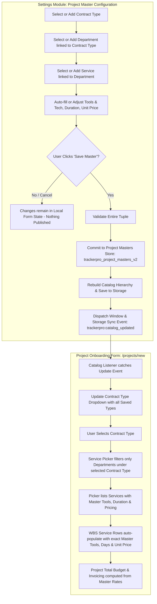
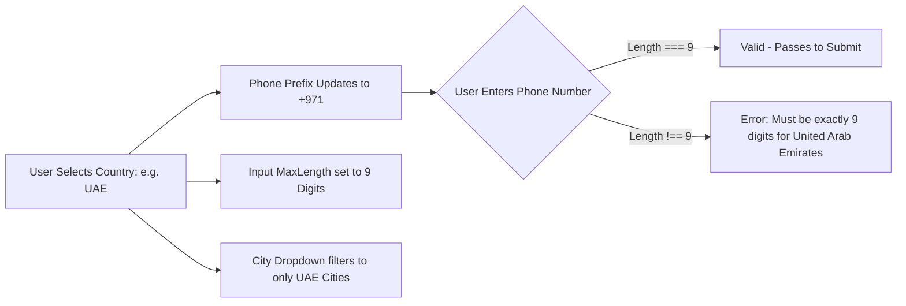

# Project Master Configuration & Onboarding Synchronization Logic

## 1. User Prompt & Objective

### 1.1 Original User Prompt
> *"i want to chnage setting module masters where in project master all feilds are depended on each other like if new contrat type is adding or existing contract type i want to add new service or i want to add new service or department tools and technology and pricing and when i am click on save master then only it should reflect on project onboarding form so write logic behind it properly and give me plan"*

### 1.2 Core Objective
To establish a strictly dependent hierarchical master configuration workflow in **Settings &rarr; Masters &rarr; Project Masters**, where:
1. Every field cascades based on previous selections:
   $$\text{Contract Type} \longrightarrow \text{Department} \longrightarrow \text{Service} \longrightarrow (\text{Tools \& Technologies}, \text{Duration}, \text{Unit Price / Pricing})$$
2. New contract types, departments, and services can be staged and configured seamlessly.
3. Selecting an existing service auto-populates its configured tools & technologies, duration, and unit price, which can be modified before saving.
4. **Save-Gated Publishing:** Staged or half-configured items in the Masters UI must **never** leak or reflect in the **Project Onboarding Form (`/projects/new`)** until the user explicitly clicks the **"Save Master"** button.
5. Once **"Save Master"** is clicked, all dependent records and catalog hierarchies immediately synchronize and reflect in real time across the Project Onboarding Form, Service Picker, and WBS calculations.

---

## 2. Current State vs. Target State Analysis

| Capability | Current State | Target State |
|---|---|---|
| **Field Dependency** | Standalone dropdowns; selecting Contract Type does not filter Departments, and selecting Department only loosely filters Services. | **Strict cascading hierarchy:** Contract Type determines available Departments; Department determines available Services; Service determines standard Tools, Duration, and Pricing. |
| **Adding New Levels** | Clicking `[+]` in modals immediately commits new items to `localStorage` before the master package is completed. | **Staged state:** Adding a new Contract Type, Department, or Service stages it in the form. **Only clicking "Save Master" commits and publishes the record globally.** |
| **Tools & Pricing Population** | Manual text fields with partial pre-fill only on service select; out-of-sync with saved project masters. | **Instant bidirectional synchronization:** Selecting an existing service pulls its exact master tools, duration, and unit price into the form for instant viewing or fine-tuning. |
| **Onboarding Form Integration** | Hardcoded `DEPT_SERVICES` and `DEPT_GROUPS` constants in `/projects/new`. Ignores custom Project Masters saved in Settings. | **Dynamic Master Catalog:** Onboarding form reads directly from committed Project Masters. Any saved Contract Type, Department, Service, Tools, and Pricing dynamically populate the Onboarding Service Picker and WBS rows. |
| **Contract Type Filtering** | Hardcoded logic in onboarding only handles `"Resource Based"` vs `"Scope Based"`. | **Universal Contract Type Engine:** Any contract type (default or custom) dynamically filters its own associated departments and services. |
| **Reactivity** | Manual page reload or incomplete cross-component event sync. | **Instant cross-tab & cross-component event broadcast** via storage and custom window events (`CATALOG_UPDATE_EVENT`). |

---

## 3. Architectural Blueprint & Data Flow



---

## 4. Detailed Field Dependency & Cascading Logic

### 4.1 Hierarchical Dependency Tree
```
Contract Type (e.g., Scope Based, Resource Based, Fixed Bid, Retainer)
  │
  └── Department (e.g., Penetration Testing, Cloud Security, Red Team)
        │
        └── Service (e.g., Web Application Penetration Testing, API Pentest)
              │
              ├── Tools & Technologies (e.g., "Burp Suite, OWASP ZAP")
              ├── Duration (e.g., "5 Days")
              └── Unit Price / Pricing (e.g., ₹50,000 / $50,000)
```

### 4.2 Field Interaction Matrix

| Field | Trigger Event | Resulting Behavior |
|---|---|---|
| **Contract Type** | User selects an existing Contract Type | 1. Updates `selectedContractType`.<br>2. Clears `selectedDepartment` and `selectedService`.<br>3. Clears `tools`, `duration`, and `unitPrice`.<br>4. Re-computes `availableDepartments` for this Contract Type only. |
| **Contract Type `[+]`** | User clicks `[+]` and submits modal | 1. Sets `selectedContractType` to the new name in local form state.<br>2. Sets `availableDepartments` to empty (ready for user to add departments for this new contract type).<br>3. Clears downstream fields.<br>4. **Does not write to storage yet.** |
| **Department** | User selects an existing Department | 1. Updates `selectedDepartment`.<br>2. Clears `selectedService`, `tools`, `duration`, and `unitPrice`.<br>3. Re-computes `availableServices` for this Department and Contract Type. |
| **Department `[+]`** | User clicks `[+]` and submits modal | 1. Sets `selectedDepartment` to the new department name in local form state.<br>2. Clears `selectedService`, `tools`, `duration`, and `unitPrice`.<br>3. **Does not write to storage yet.** |
| **Service** | User selects an existing Service | 1. Updates `selectedService`.<br>2. Finds the matching master item for `(selectedContractType, selectedDepartment, selectedService)`.<br>3. **Automatically auto-fills:**<br>&nbsp;&nbsp;&bull; `tools = matched.tools`<br>&nbsp;&nbsp;&bull; `duration = matched.duration`<br>&nbsp;&nbsp;&bull; `unitPrice = matched.unitPrice`. |
| **Service `[+]`** | User clicks `[+]` and submits modal | 1. Sets `selectedService` to the new service name.<br>2. Allows entering or pre-filling `tools`, `duration`, and `unitPrice` in the form.<br>3. **Does not write to storage yet.** |
| **Tools, Duration, Price** | User edits inputs | User can adjust or customize the delivery tools, standard duration, and billing rate for this master package before saving. |
| **Save Master Button** | User clicks `Save Master` | 1. Validates all required fields are filled and valid.<br>2. Checks if updating an existing record or inserting a new one.<br>3. Commits to `projectMasters` and triggers catalog generation.<br>4. Syncs storage and triggers event for Onboarding form. |

---

## 5. Save-Gated Publishing Logic (Stage vs. Commit)

To satisfy the user requirement:
> *"and when i am click on save master then only it should reflect on project onboarding form"*

### 5.1 Staged State vs. Committed State
```typescript
// 1. Local Staged State (Inside Settings UI Component)
interface StagedMasterFormState {
  contractType: string;
  department: string;
  service: string;
  tools: string;
  duration: string;
  unitPrice: string;
  isNewContractType: boolean;
  isNewDepartment: boolean;
  isNewService: boolean;
}

// 2. Committed Global State (Shared Storage & Onboarding Store)
interface ProjectMasterItem {
  id: string;
  contractType: string;
  group: string;
  department: string;
  service: string;
  tools: string;
  duration: string;
  unitPrice: number;
  createdAt: string;
}
```

### 5.2 Commit Algorithm on "Save Master"
```typescript
function handleSaveMaster(staged: StagedMasterFormState) {
  // Step 1: Strict Validation
  if (!staged.contractType.trim()) throw new Error("Contract Type is required.");
  if (!staged.department.trim()) throw new Error("Department is required.");
  if (!staged.service.trim()) throw new Error("Service name is required.");
  if (!staged.tools.trim()) throw new Error("Tools & Technologies are required.");
  if (!staged.duration.trim()) throw new Error("Duration is required.");
  const price = Number(staged.unitPrice);
  if (isNaN(price) || price <= 0) throw new Error("Unit Price must be a positive number.");

  // Step 2: Check Existing Master or Create New
  const existingIndex = projectMasters.findIndex(
    (p) =>
      p.contractType.toLowerCase() === staged.contractType.trim().toLowerCase() &&
      p.department.toLowerCase() === staged.department.trim().toLowerCase() &&
      p.service.toLowerCase() === staged.service.trim().toLowerCase()
  );

  let updatedMasters: ProjectMasterItem[];
  if (existingIndex >= 0) {
    // Update existing master record
    updatedMasters = [...projectMasters];
    updatedMasters[existingIndex] = {
      ...updatedMasters[existingIndex],
      tools: staged.tools.trim(),
      duration: staged.duration.trim(),
      unitPrice: price,
    };
  } else {
    // Insert new master record
    const newMaster: ProjectMasterItem = {
      id: `pm-${Date.now()}`,
      contractType: staged.contractType.trim(),
      group: staged.contractType.trim(),
      department: staged.department.trim(),
      service: staged.service.trim(),
      tools: staged.tools.trim(),
      duration: staged.duration.trim(),
      unitPrice: price,
      createdAt: new Date().toISOString(),
    };
    updatedMasters = [newMaster, ...projectMasters];
  }

  // Step 3: Atomic Storage Write & Catalog Sync
  saveToStorage(STORAGE_KEY_PROJECT_MASTERS, updatedMasters);
  syncCatalogFromMasters(updatedMasters);

  // Step 4: Dispatch Event for Onboarding Form
  window.dispatchEvent(new CustomEvent("trackerpro:catalog_updated"));
  toast.success("Project Master saved and reflected in Project Onboarding Form!");
}
```

---

## 6. Catalog Engine: Transforming Masters for Onboarding

The Onboarding Form (`/projects/new`) requires a structured hierarchy for its **Service Picker** and **Contract Type Dropdown**.

### 6.1 Catalog Builder Function
```typescript
export interface CatalogDepartmentGroup {
  contractType: string;
  department: string;
  services: CatalogService[];
}

export function buildCatalogFromMasters(masters: ProjectMasterItem[]) {
  // 1. Extract Unique Contract Types
  const contractTypes = Array.from(new Set(masters.map((m) => m.contractType || m.group || "Scope Based")));

  // 2. Map Departments by Contract Type
  const deptsByContractType: Record<string, string[]> = {};
  for (const ct of contractTypes) {
    deptsByContractType[ct] = Array.from(
      new Set(masters.filter((m) => (m.contractType || m.group) === ct).map((m) => m.department))
    );
  }

  // 3. Map Services by (Contract Type + Department)
  const servicesByDeptAndContract: Record<string, CatalogService[]> = {};
  for (const m of masters) {
    const key = `${m.contractType}:::${m.department}`;
    if (!servicesByDeptAndContract[key]) {
      servicesByDeptAndContract[key] = [];
    }
    const daysMatch = m.duration.match(/\d+/);
    const parsedDays = daysMatch ? parseInt(daysMatch[0], 10) : 5;

    servicesByDeptAndContract[key].push({
      id: m.id,
      name: m.service,
      tool: m.tools,
      unitPrice: m.unitPrice,
      days: parsedDays,
      subDept: m.department, // Grouped under department
    });
  }

  return {
    contractTypes,
    deptsByContractType,
    servicesByDeptAndContract,
  };
}
```

---

## 7. Project Onboarding Form (`/projects/new`) Integration

### 7.1 Header Contract Type Dropdown
- Options are dynamically sourced from `catalog.contractTypes`.
- When the user selects a Contract Type:
  - If services were already added, prompt or clear services to ensure contract integrity.
  - Updates `contractType` state.

### 7.2 Service Picker (`+ Add Services`)
When the user clicks **"+ Add Services"**:
1. **Department Listing:**
   ```typescript
   const allowedDepts = useMemo(() => {
     if (!contractType) return [];
     return catalog.deptsByContractType[contractType] || [];
   }, [contractType, catalog]);
   ```
2. **Service Listing for Selected Department:**
   ```typescript
   const availableServicesForDept = useMemo(() => {
     if (!contractType || !pickerDept) return [];
     const key = `${contractType}:::${pickerDept}`;
     return catalog.servicesByDeptAndContract[key] || [];
   }, [contractType, pickerDept, catalog]);
   ```
3. **Auto-Populating WBS Service Row:**
   When the user checks a service and clicks "Add Selected Services", each row in the WBS table receives:
   - `name`: `svc.name`
   - `dept`: `pickerDept`
   - `tools`: `svc.tool` *(exact tools from Master)*
   - `unitPrice`: `svc.unitPrice` *(exact price from Master)*
   - `durationDays`: `svc.days` *(exact days from Master)*
   - `total`: `svc.unitPrice * qty`

---

## 8. Implementation Steps & Checklist

- [ ] **Step 1: Unify Master & Catalog State in `project-catalog-store.ts`**
  - Implement `buildCatalogFromMasters(projectMasters)`.
  - Export reactive hook `useProjectMastersCatalog()`.
  - Ensure storage event listener synchronizes all components automatically.
- [ ] **Step 2: Refactor Project Masters UI in `project-masters-section.tsx`**
  - Implement local staged state for Contract Type, Department, and Service.
  - Filter Department dropdown based on the active `selectedContractType`.
  - Filter Service dropdown based on the active `selectedDepartment`.
  - On selecting a Service, auto-fill `tools`, `duration`, and `unitPrice`.
  - Ensure `[+]` modals only update local form values without committing to storage.
  - Wire `Save Master` button to validate, commit to `projectMasters`, sync catalog, and broadcast event.
- [ ] **Step 3: Update Project Onboarding Form in `projects.new.tsx`**
  - Replace static `DEPT_SERVICES` and `DEPT_GROUPS` with dynamic catalog from `useProjectMastersCatalog()`.
  - Update `allowedDepts` to read `catalog.deptsByContractType[contractType]`.
  - Update `filteredPickerServices` to read `catalog.servicesByDeptAndContract[`${contractType}:::${dept}`]`.
  - Connect auto-population of tools, unit price, and duration to WBS rows.
- [ ] **Step 4: Customer Masters: Country-City Dependency & Phone Validation**
  - Add Country selection and auto-generated City Code when configuring Cities.
  - Add `PhoneCode` (e.g. `+91`, `+1`) and `PhoneDigits` (e.g. `10`, `9`, `8`) fields to Country Master configuration.
  - Wire dynamic phone validation in Customer Onboarding (`enhanced-customer-modal.tsx` & `customers.index.tsx`) to strictly enforce the configured phone digits.
- [ ] **Step 5: End-to-End Verification**
  - Add a brand-new Contract Type (e.g. `"Retainer Security"`).
  - Add a Department under it (e.g. `"SOC Monitoring"`).
  - Add a Service under it (e.g. `"24/7 SIEM Triage"`) with Tools `"Splunk, Wazuh"`, Duration `"30 Days"`, Unit Price `"150000"`.
  - Verify Onboarding does **not** show it before clicking `Save Master`.
  - Click `Save Master`.
  - Open `/projects/new`, verify `"Retainer Security"` is present in Contract Type dropdown.
  - Select it &rarr; open Service Picker &rarr; verify `"SOC Monitoring"` &rarr; `"24/7 SIEM Triage"` appears with exact tools and price ₹150,000.
  - Add a new Country with `+971` and `9` digits &rarr; verify in Customer modal that entering 9 digits passes and anything else shows exact validation error.

---

## 9. Customer Masters: Country-City Dependency & Phone Validation Logic

### 9.1 The Need for Phone Code & Digit Validation
In Customer Onboarding (`enhanced-customer-modal.tsx` and `customers.index.tsx`), each country has unique phone number rules:
- **India (`IN`)**: Dial Code `+91`, Exactly **10** digits.
- **United States (`US`)**: Dial Code `+1`, Exactly **10** digits.
- **United Arab Emirates (`AE`)**: Dial Code `+971`, Exactly **9** digits.
- **Singapore (`SG`)**: Dial Code `+65`, Exactly **8** digits.
- **Germany (`DE`)**: Dial Code `+49`, Exactly **11** digits.

The database table `mst_countries` already specifies:
- `Code`: ISO Alpha (e.g. `IN`, `US`, `AE`)
- `PhoneCode`: Dialing prefix (e.g. `+91`, `+1`, `+971`)
- `PhoneDigits`: Expected number of digits (default: `10`, range: `7` to `15`)

### 9.2 Country Configuration in Masters
When an admin configures or edits a **Country** in **Settings &rarr; Masters &rarr; Customer Masters**:
1. **Country Name** (e.g., `United Arab Emirates`)
2. **ISO Code** (e.g., `AE`)
3. **Phone Dial Code** (e.g., `+971`)
4. **Phone Digits Count** (e.g., `9`)

### 9.3 City Configuration in Masters (Dependent on Country)
1. **Parent Country**: Required dropdown selecting one of the configured countries.
2. **City Name**: Name of the city (e.g., `Dubai`, `Abu Dhabi`).
3. **City Code**:
   - **Auto-generated by default**: `${countryCode.toLowerCase()}_${cityName.toLowerCase().replace(/\s+/g, '_')}` (e.g. `ae_dubai`).
   - **Customizable**: User can type a custom code (e.g. `DXB`).

### 9.4 Real-time Validation Flow in Customer Onboarding Form


