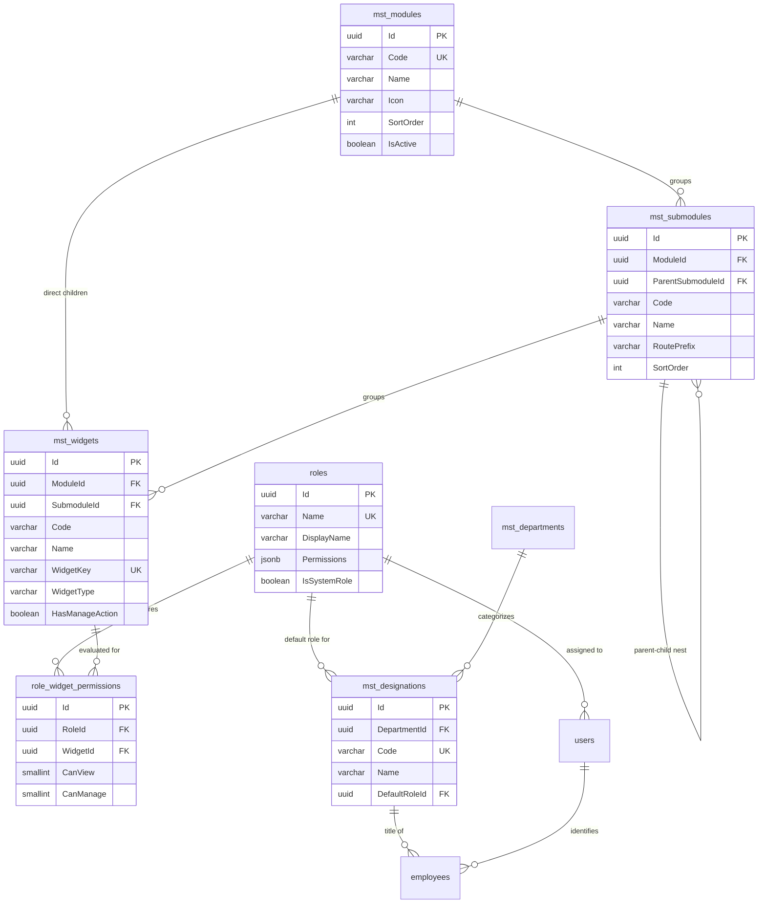
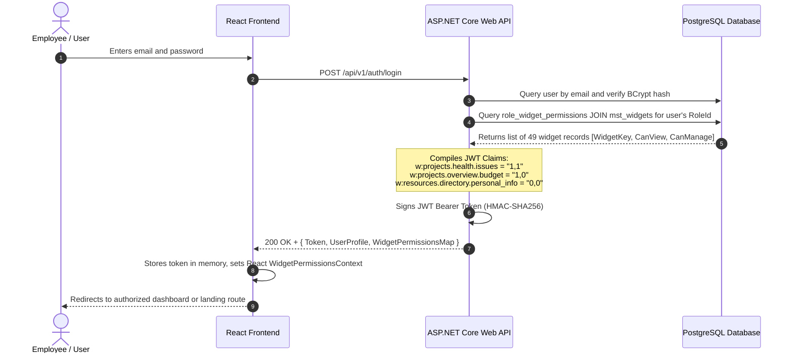
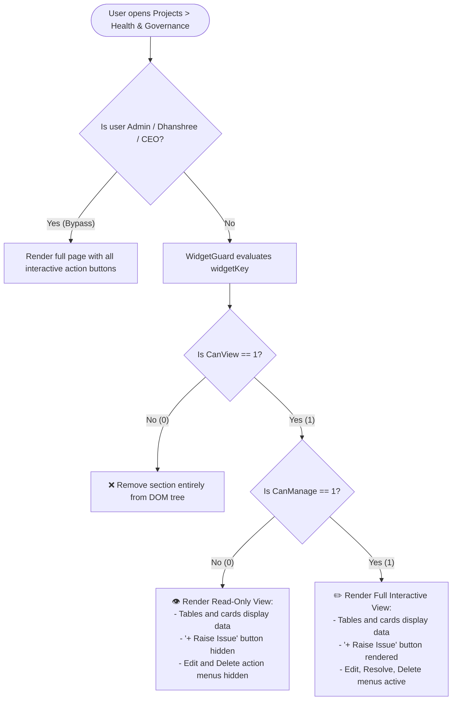
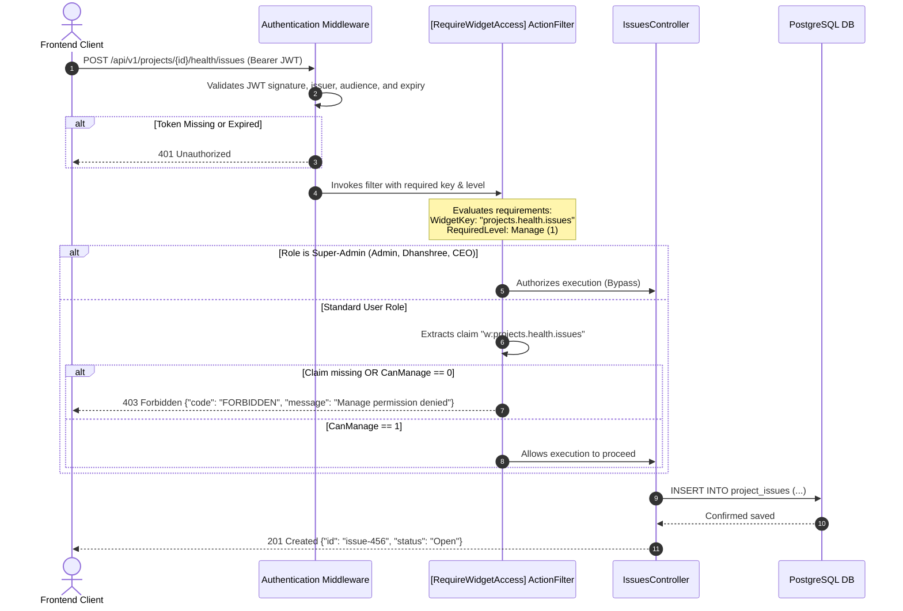
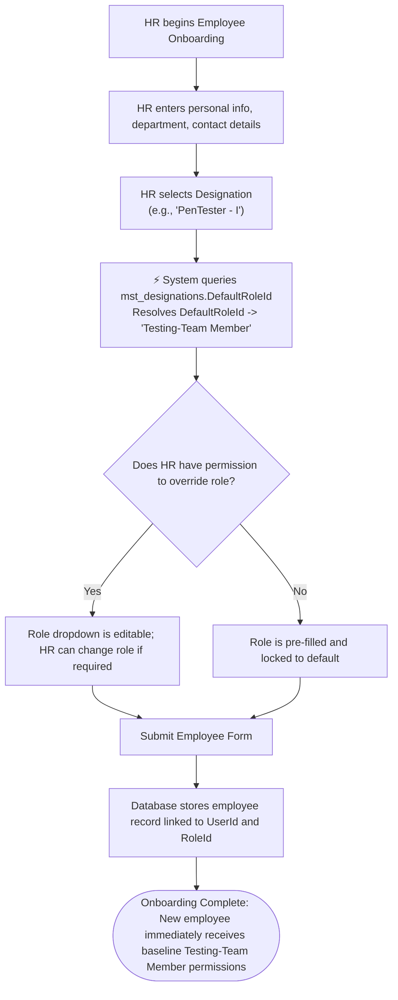
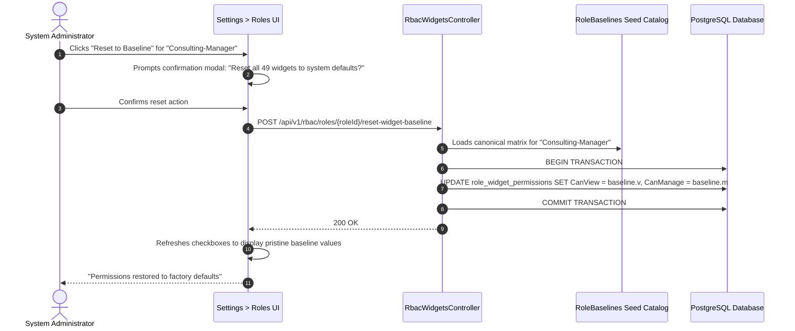

# Complete RBAC Implementation, Workflows & Database Architecture Guide
## TrackerPro / Pulse PMO — 4-Tier Role-Based Access Control Specification

This comprehensive guide details the **entire Role-Based Access Control (RBAC) architecture** in TrackerPro (Pulse PMO). It covers the full lifecycle from database schema design and constraints, backend authorization guards, frontend reactive permission evaluation, administrative control matrices, and automated employee onboarding.

---

## Table of Contents
1. [Core Architectural Model](#1-core-architectural-model)
2. [Complete Database Schema & Constraints](#2-complete-database-schema--constraints)
   - [ER Diagram & Relationship Map](#er-diagram--relationship-map)
   - [Table DDL & Active Constraints](#table-ddl--active-constraints)
   - [Designation-to-Role Mapping Schema](#designation-to-role-mapping-schema)
3. [Master Catalog Hierarchy (9 Modules, 32 Submodules, 49 Widgets)](#3-master-catalog-hierarchy)
4. [End-to-End RBAC Workflows](#4-end-to-end-rbac-workflows)
   - [Workflow 1: User Login & Claims Compilation](#workflow-1-user-login--claims-compilation)
   - [Workflow 2: UI Rendering & Granular Component Protection (Frontend)](#workflow-2-ui-rendering--granular-component-protection-frontend)
   - [Workflow 3: Declarative API Request Protection (Backend Guard)](#workflow-3-declarative-api-request-protection-backend-guard)
   - [Workflow 4: Admin Customization Matrix (Settings Real-Time Updates)](#workflow-4-admin-customization-matrix-settings-real-time-updates)
   - [Workflow 5: Employee Onboarding & Automated Role Assignment](#workflow-5-employee-onboarding--automated-role-assignment)
   - [Workflow 6: System Baseline Restoration](#workflow-6-system-baseline-restoration)
5. [Code Implementation Blueprints](#5-code-implementation-blueprints)
   - [Backend: C# Entity Framework Core & Custom Filters](#backend-c-entity-framework-core--custom-filters)
   - [Frontend: React Hooks & WidgetGuard Component](#frontend-react-hooks--widgetguard-component)
6. [Side-by-Side Persona Matrix](#6-side-by-side-persona-matrix)
7. [Security Guarantees & Best Practices](#7-security-guarantees--best-practices)

---

## 1. Core Architectural Model

TrackerPro uses a **hierarchical 4-tier model** paired with **binary flags (`0` or `1`)** stored at the granular widget level:

```
┌────────────────────────────────────────────────────────────────────────┐
│                                1. ROLE                                 │
│        (e.g., Testing-Manager, PMO, Consulting-Senior Manager)         │
└───────────────────────────────────┬────────────────────────────────────┘
                                    │ has many
                                    ▼
┌────────────────────────────────────────────────────────────────────────┐
│                               2. MODULE                                │
│       (e.g., Projects, Resources, Customers, Reports, Settings)        │
└───────────────────────────────────┬────────────────────────────────────┘
                                    │ contains (1:N)
                                    ▼
┌────────────────────────────────────────────────────────────────────────┐
│                              3. SUBMODULE                              │
│   (e.g., Overview, Health & Governance, WBS, Resource Directory)       │
└───────────────────────────────────┬────────────────────────────────────┘
                                    │ contains (1:N, supports nesting)
                                    ▼
┌────────────────────────────────────────────────────────────────────────┐
│                               4. WIDGET                                │
│    (e.g., Issue Tracker, Budget Summary, Extension Request, Timesheet) │
└───────────────────────────────────┬────────────────────────────────────┘
                                    │ evaluated to
                                    ▼
          ┌────────────────────────────────────────────────────┐
          │            5. BINARY PERMISSIONS (0 / 1)           │
          │      CanView: 0 or 1   │   CanManage: 0 or 1       │
          └────────────────────────────────────────────────────┘
```

### The Three Operational States

Every component, widget, tab, or action button resolves into one of three explicit states:

| Operational State | `CanView` | `CanManage` | Frontend UI Experience | Backend API Enforcement |
| :--- | :---: | :---: | :--- | :--- |
| **Hidden** | `0` | `0` | Completely absent from DOM; navigation tabs/menus hidden. | All Read (`GET`) & Write (`POST`/`PUT`/`DELETE`) return `403 Forbidden`. |
| **Read-Only** | `1` | `0` | Data visible (tables, charts, KPI cards); Action buttons ("+ Add", "Edit", "Delete", "Upload") hidden or disabled. | Read requests (`GET`) succeed (`200 OK`); Write requests return `403 Forbidden`. |
| **Full Manage** | `1` | `1` | Unrestricted access; all buttons, dialogs, status dropdowns, and form submits enabled. | All requests (`GET`, `POST`, `PUT`, `DELETE`) succeed (`200 OK`). |

> **Foundational Integrity Rule**: `CanManage = 1` strictly requires `CanView = 1`. A user can never possess management/write rights on a resource they cannot view.

---

## 2. Complete Database Schema & Constraints

> [!IMPORTANT]
> **Database Status: Tables Already Exist — No Need to Create New Tables!**
> All tables (`mst_modules`, `mst_submodules`, `mst_widgets`, `role_widget_permissions`, `mst_designations.DefaultRoleId`), seed rows (9 modules, 32 submodules, 49 widgets, 1,372 baseline permissions), and constraints are **already created and active in the database (`trackerpro`)**.
> 
> **You do NOT need to create new tables, run fresh migration scripts, or re-execute DDL commands.**
> 
> If you need to make changes or integrate new features, **always use and bind to these existing tables and constraints**. The DDL and constraint definitions below are provided as the definitive reference.

### ER Diagram & Relationship Map



---

### Table DDL & Active Constraints (Live Reference — Already Created in DB)

Here is the exact schema and constraints of the **already created and active** PostgreSQL tables in `trackerpro`. Use this as the canonical structural reference:

#### 1. Module Master (`mst_modules`)
```sql
CREATE TABLE public.mst_modules (
    "Id" uuid DEFAULT gen_random_uuid() NOT NULL,
    "Code" character varying(80) NOT NULL,
    "Name" character varying(150) NOT NULL,
    "Icon" character varying(80),
    "SortOrder" integer DEFAULT 0 NOT NULL,
    "IsActive" boolean DEFAULT true NOT NULL,
    "CreatedAtUtc" timestamp with time zone DEFAULT now() NOT NULL,
    "UpdatedAtUtc" timestamp with time zone,
    "CreatedBy" uuid,
    "UpdatedBy" uuid,
    "DeletedAtUtc" timestamp with time zone,
    
    CONSTRAINT mst_modules_pkey PRIMARY KEY ("Id"),
    CONSTRAINT mst_modules_Code_key UNIQUE ("Code")
);

CREATE INDEX "IX_mst_modules_Code" ON public.mst_modules ("Code");
```

#### 2. Submodule Master (`mst_submodules`)
Supports multi-level hierarchies (e.g. `Projects -> Projects Cards -> Health & Governance`).
```sql
CREATE TABLE public.mst_submodules (
    "Id" uuid DEFAULT gen_random_uuid() NOT NULL,
    "ModuleId" uuid NOT NULL,
    "ParentSubmoduleId" uuid,
    "Code" character varying(80) NOT NULL,
    "Name" character varying(150) NOT NULL,
    "RoutePrefix" character varying(150),
    "SortOrder" integer DEFAULT 0 NOT NULL,
    "IsActive" boolean DEFAULT true NOT NULL,
    "CreatedAtUtc" timestamp with time zone DEFAULT now() NOT NULL,
    "UpdatedAtUtc" timestamp with time zone,
    "CreatedBy" uuid,
    "UpdatedBy" uuid,
    "DeletedAtUtc" timestamp with time zone,
    
    CONSTRAINT mst_submodules_pkey PRIMARY KEY ("Id"),
    CONSTRAINT "FK_mst_submodules_Module" FOREIGN KEY ("ModuleId") 
        REFERENCES public.mst_modules("Id") ON DELETE CASCADE,
    CONSTRAINT "FK_mst_submodules_Parent" FOREIGN KEY ("ParentSubmoduleId") 
        REFERENCES public.mst_submodules("Id") ON DELETE CASCADE,
    CONSTRAINT "UQ_submodule_module_parent_code" 
        UNIQUE ("ModuleId", "ParentSubmoduleId", "Code")
);

CREATE INDEX "IX_mst_submodules_ModuleId" ON public.mst_submodules ("ModuleId");
CREATE INDEX "IX_mst_submodules_ParentSubmoduleId" ON public.mst_submodules ("ParentSubmoduleId");
CREATE INDEX "IX_mst_submodules_Code" ON public.mst_submodules ("Code");
```

#### 3. Widget Master (`mst_widgets`)
Defines the leaf securable items in the system.
```sql
CREATE TABLE public.mst_widgets (
    "Id" uuid DEFAULT gen_random_uuid() NOT NULL,
    "SubmoduleId" uuid,
    "ModuleId" uuid,
    "Code" character varying(100) NOT NULL,
    "Name" character varying(150) NOT NULL,
    "WidgetKey" character varying(200) NOT NULL,
    "WidgetType" character varying(40) DEFAULT 'widget'::character varying NOT NULL,
    "HasManageAction" boolean DEFAULT true NOT NULL,
    "Description" character varying(500),
    "SortOrder" integer DEFAULT 0 NOT NULL,
    "IsActive" boolean DEFAULT true NOT NULL,
    "CreatedAtUtc" timestamp with time zone DEFAULT now() NOT NULL,
    "UpdatedAtUtc" timestamp with time zone,
    "CreatedBy" uuid,
    "UpdatedBy" uuid,
    "DeletedAtUtc" timestamp with time zone,
    
    CONSTRAINT mst_widgets_pkey PRIMARY KEY ("Id"),
    CONSTRAINT "mst_widgets_WidgetKey_key" UNIQUE ("WidgetKey"),
    CONSTRAINT "FK_mst_widgets_Module" FOREIGN KEY ("ModuleId") 
        REFERENCES public.mst_modules("Id") ON DELETE CASCADE,
    CONSTRAINT "FK_mst_widgets_Submodule" FOREIGN KEY ("SubmoduleId") 
        REFERENCES public.mst_submodules("Id") ON DELETE CASCADE
);

CREATE INDEX "IX_mst_widgets_WidgetKey" ON public.mst_widgets ("WidgetKey");
CREATE INDEX "IX_mst_widgets_SubmoduleId" ON public.mst_widgets ("SubmoduleId");
CREATE INDEX "IX_mst_widgets_ModuleId" ON public.mst_widgets ("ModuleId");
```

#### 4. Role Widget Permissions (`role_widget_permissions`)
The core junction table holding binary `CanView` and `CanManage` flags with integrity rules enforced at the database engine level.
```sql
CREATE TABLE public.role_widget_permissions (
    "Id" uuid DEFAULT gen_random_uuid() NOT NULL,
    "RoleId" uuid NOT NULL,
    "WidgetId" uuid NOT NULL,
    "CanView" smallint DEFAULT 0 NOT NULL,
    "CanManage" smallint DEFAULT 0 NOT NULL,
    "CreatedAtUtc" timestamp with time zone DEFAULT now() NOT NULL,
    "UpdatedAtUtc" timestamp with time zone,
    "CreatedBy" uuid,
    "UpdatedBy" uuid,
    "DeletedAtUtc" timestamp with time zone,
    
    CONSTRAINT role_widget_permissions_pkey PRIMARY KEY ("Id"),
    CONSTRAINT "UQ_role_widget_permissions" UNIQUE ("RoleId", "WidgetId"),
    CONSTRAINT "FK_role_widget_RoleId" FOREIGN KEY ("RoleId") 
        REFERENCES public.roles("Id") ON DELETE CASCADE,
    CONSTRAINT "FK_role_widget_WidgetId" FOREIGN KEY ("WidgetId") 
        REFERENCES public.mst_widgets("Id") ON DELETE CASCADE,
    
    -- Binary Value Enforcement (Only 0 or 1 permitted)
    CONSTRAINT "CHK_role_widget_can_view_binary" 
        CHECK ("CanView" IN (0, 1)),
    CONSTRAINT "CHK_role_widget_can_manage_binary" 
        CHECK ("CanManage" IN (0, 1)),
        
    -- Logical Integrity: Management strictly requires View permissions
    CONSTRAINT "CHK_role_widget_manage_requires_view" 
        CHECK (("CanManage" = 0) OR ("CanView" = 1))
);

CREATE INDEX "IX_role_widget_permissions_RoleId" ON public.role_widget_permissions ("RoleId");
CREATE INDEX "IX_role_widget_permissions_WidgetId" ON public.role_widget_permissions ("WidgetId");
```

#### 5. Designation Linkage (`mst_designations`)
Links an HR Job Designation to its default RBAC Role for automated zero-touch provisioning.
```sql
ALTER TABLE public.mst_designations
    ADD COLUMN IF NOT EXISTS "DefaultRoleId" uuid REFERENCES public.roles("Id") ON DELETE SET NULL;

CREATE INDEX IF NOT EXISTS "IX_mst_designations_DefaultRoleId" ON public.mst_designations ("DefaultRoleId");
```

---

## 3. Master Catalog Hierarchy

TrackerPro defines **9 Top-Level Modules**, **32 Submodules**, and **49 Granular Widgets**:

| Module | Submodule / Group | Widget Key | Widget Type | Manageable |
| :--- | :--- | :--- | :---: | :---: |
| **1. Dashboard** | *(Direct)* | `dashboard.kpis` | `kpi_card` | ❌ No |
| | *(Direct)* | `dashboard.assigned_projects` | `widget` | ❌ No |
| | *(Direct)* | `dashboard.pending_issues` | `widget` | ❌ No |
| | *(Direct)* | `dashboard.project_status` | `widget` | ❌ No |
| | *(Direct)* | `dashboard.pending_approvals` | `widget` | ❌ No |
| **2. Action Center** | Bucket List | `action_center.bucket_list.raise_issues` | `action` | ✅ Yes |
| | Bucket List | `action_center.bucket_list.start_timer` | `action` | ✅ Yes |
| | Approvals | `action_center.approvals` | `widget` | ✅ Yes |
| | Alerts | `action_center.alerts` | `widget` | ✅ Yes |
| | Notifications | `action_center.notifications` | `widget` | ✅ Yes |
| **3. Projects** | Overview | `projects.overview.budget` | `widget` | ✅ Yes |
| | Overview | `projects.overview.extension_request` | `widget` | ✅ Yes |
| | Overview | `projects.overview.assign_spm` | `action` | ✅ Yes |
| | Overview | `projects.overview.assign_pm` | `action` | ✅ Yes |
| | Overview | `projects.overview.assign_tl` | `action` | ✅ Yes |
| | WBS | `projects.wbs.billing_info` | `widget` | ✅ Yes |
| | WBS | `projects.wbs.pmo_intake` | `widget` | ✅ Yes |
| | WBS | `projects.wbs.invoice_schedule` | `widget` | ✅ Yes |
| | Team | `projects.team.allocation` | `widget` | ✅ Yes |
| | Task | `projects.task.management` | `widget` | ✅ Yes |
| | Health & Governance | `projects.health.issues` | `widget` | ✅ Yes |
| | Health & Governance | `projects.health.alerts` | `widget` | ✅ Yes |
| | Health & Governance | `projects.health.escalation` | `widget` | ✅ Yes |
| | Health & Governance | `projects.health.appreciation` | `widget` | ✅ Yes |
| | Health & Governance | `projects.health.engagement.interview` | `tab` | ✅ Yes |
| | Health & Governance | `projects.health.engagement.requirements`| `tab` | ✅ Yes |
| | Invoice | `projects.invoice.management` | `widget` | ✅ Yes |
| **4. Reports** | Sales Report | `reports.sales` | `widget` | ✅ Yes |
| | WBS Tracker | `reports.wbs_tracker` | `widget` | ✅ Yes |
| | PO Tracker | `reports.po_tracker` | `widget` | ✅ Yes |
| | Invoice Tracker | `reports.invoice_tracker` | `widget` | ✅ Yes |
| **5. Resource** | Resource Directory | `resources.directory.personal_info` | `tab` | ✅ Yes |
| | Resource Directory | `resources.directory.org_details` | `tab` | ✅ Yes |
| | Resource Directory | `resources.directory.employment_bond` | `tab` | ✅ Yes |
| | Resource Directory | `resources.directory.education_exp` | `tab` | ✅ Yes |
| | Resource Directory | `resources.directory.pmo_info` | `tab` | ✅ Yes |
| | Resource Directory | `resources.directory.activity_logs` | `tab` | ❌ No |
| | Resource Pool | `resources.resource_pool` | `widget` | ✅ Yes |
| | Exit Summary | `resources.exit_summary` | `widget` | ✅ Yes |
| **6. Customers** | Customer Profile | `customers.customer_profile` | `widget` | ✅ Yes |
| **7. Repository** | *(Direct)* | `repository.documents` | `widget` | ✅ Yes |
| **8. My Team** | Team Dashboard | `my_team.dashboard` | `widget` | ✅ Yes |
| | Timesheets | `my_team.my_timesheet` | `widget` | ✅ Yes |
| | Timesheets | `my_team.timesheet_approval` | `widget` | ✅ Yes |
| **9. Settings** | Roles & Permission | `settings.roles.modules_access` | `widget` | ✅ Yes |
| | Roles & Permission | `settings.roles.user_access` | `widget` | ✅ Yes |
| | Masters | `settings.masters.project` | `widget` | ✅ Yes |
| | Masters | `settings.masters.customer` | `widget` | ✅ Yes |
| | Masters | `settings.masters.resource` | `widget` | ✅ Yes |

---

## 4. End-to-End RBAC Workflows

### Workflow 1: User Login & Claims Compilation



---

### Workflow 2: UI Rendering & Granular Component Protection (Frontend)



---

### Workflow 3: Declarative API Request Protection (Backend Guard)



---

### Workflow 4: Admin Customization Matrix (Settings Real-Time Updates)

```mermaid
sequenceDiagram
    autonumber
    actor Admin as System Administrator
    participant UI as Settings > Security Roles UI
    participant API as RbacWidgetsController
    participant DB as PostgreSQL Database

    Admin->>UI: Selects Role (e.g. "Testing-Team Leader")
    UI->>API: GET /api/v1/rbac/catalog-tree?roleId={id}
    API->>DB: Query modules, submodules, widgets joined with role permissions
    DB-->>API: Returns full 4-tier tree with CanView and CanManage flags
    API-->>UI: Renders interactive toggle table

    Note over Admin,UI: Admin unchecks "CanView" on Budget Summary.<br/>UI automatically turns off "CanManage" and disables it.<br/>Admin checks "CanManage" on Health Issues.<br/>UI automatically turns on "CanView".

    Admin->>UI: Clicks "Save Changes"
    UI->>API: PUT /api/v1/rbac/roles/{roleId}/widget-permissions<br/>Payload: [{ WidgetId, CanView: 1, CanManage: 0 }, ...]
    
    API->>DB: BEGIN TRANSACTION
    API->>DB: INSERT INTO role_widget_permissions (...)<br/>ON CONFLICT ("RoleId", "WidgetId") DO UPDATE ...
    API->>DB: COMMIT TRANSACTION

    API-->>UI: 200 OK {"message": "Permissions updated successfully"}
    UI-->>Admin: Displays toast notification; role changes are effective immediately
```

---

### Workflow 5: Employee Onboarding & Automated Role Assignment



---

### Workflow 6: System Baseline Restoration



---

## 5. Code Implementation Blueprints

### Backend: C# Entity Framework Core & Custom Filters

#### 1. Entity Definition (`RoleWidgetPermission.cs`)
```csharp
using PMS.API.Modules.Resources.Models;
using PMS.API.Shared.Common.Models;

namespace PMS.API.Modules.Users.Models;

public class RoleWidgetPermission : BaseEntity
{
    public Guid RoleId { get; set; }
    public Role Role { get; set; } = null!;

    public Guid WidgetId { get; set; }
    public MstWidget Widget { get; set; } = null!;

    /// <summary>0 = Hidden, 1 = Allowed</summary>
    public short CanView { get; set; }

    /// <summary>0 = Denied, 1 = Allowed</summary>
    public short CanManage { get; set; }
}
```

#### 2. Declarative Controller Attribute (`RequireWidgetAccessAttribute.cs`)
```csharp
using Microsoft.AspNetCore.Mvc;
using Microsoft.AspNetCore.Mvc.Filters;
using PMS.API.Infrastructure.Authorization;

namespace PMS.API.Infrastructure.Authorization;

public enum WidgetAccessLevel { View = 0, Manage = 1 }

[AttributeUsage(AttributeTargets.Method | AttributeTargets.Class, AllowMultiple = true)]
public class RequireWidgetAccessAttribute(string widgetKey, WidgetAccessLevel level = WidgetAccessLevel.View) 
    : TypeFilterAttribute(typeof(RequireWidgetAccessFilter))
{
    public string WidgetKey { get; } = widgetKey;
    public WidgetAccessLevel Level { get; } = level;
}

public class RequireWidgetAccessFilter(
    string widgetKey, 
    WidgetAccessLevel level, 
    ICurrentUserService currentUser) : IAsyncActionFilter
{
    public async Task OnActionExecutionAsync(ActionExecutingContext context, ActionExecutionDelegate next)
    {
        // 1. Super-admin roles bypass all widget checks
        var roleName = currentUser.RoleName;
        if (roleName is "Admin" or "Dhanshree" or "CEO")
        {
            await next();
            return;
        }

        // 2. Extract widget claim: "w:{widgetKey}" -> "CanView,CanManage"
        var claimVal = currentUser.GetClaimValue($"w:{widgetKey}");
        if (string.IsNullOrEmpty(claimVal))
        {
            context.Result = new ObjectResult(new { error = "Access Denied: Missing widget entitlement" }) 
                { StatusCode = StatusCodes.Status403Forbidden };
            return;
        }

        var parts = claimVal.Split(',');
        var canView = parts.Length > 0 && parts[0] == "1";
        var canManage = parts.Length > 1 && parts[1] == "1";

        if (level == WidgetAccessLevel.View && !canView)
        {
            context.Result = new ObjectResult(new { error = "Access Denied: View permission required" }) 
                { StatusCode = StatusCodes.Status403Forbidden };
            return;
        }

        if (level == WidgetAccessLevel.Manage && !canManage)
        {
            context.Result = new ObjectResult(new { error = "Access Denied: Manage permission required" }) 
                { StatusCode = StatusCodes.Status403Forbidden };
            return;
        }

        await next();
    }
}
```

#### 3. Controller Protection Example (`ProjectsController.cs`)
```csharp
[HttpGet("{id}/health/issues")]
[RequireWidgetAccess("projects.health.issues", WidgetAccessLevel.View)]
public async Task<IActionResult> GetIssues(Guid id)
{
    return Ok(await issuesService.GetByProjectIdAsync(id));
}

[HttpPost("{id}/health/issues")]
[RequireWidgetAccess("projects.health.issues", WidgetAccessLevel.Manage)]
public async Task<IActionResult> CreateIssue(Guid id, [FromBody] CreateIssueDto dto)
{
    return CreatedAtAction(nameof(GetIssues), await issuesService.CreateAsync(id, dto));
}
```

---

### Frontend: React Hooks & WidgetGuard Component

#### 1. React Hook (`useWidgetAccess.ts`)
```tsx
import { useWidgetPermissions } from "@/lib/rbac/widget-permissions";

export function useWidgetAccess(widgetKey: string) {
  const { isSuperAdmin, getWidgetPermission } = useWidgetPermissions();

  if (isSuperAdmin) {
    return { canView: true, canManage: true, isHidden: false };
  }

  const perm = getWidgetPermission(widgetKey);
  const canView = perm?.canView === 1;
  const canManage = perm?.canManage === 1 && canView;

  return {
    canView,
    canManage,
    isHidden: !canView,
  };
}
```

#### 2. Declarative Guard Component (`WidgetGuard.tsx`)
```tsx
import React from "react";
import { useWidgetAccess } from "./useWidgetAccess";

interface WidgetGuardProps {
  widgetKey: string;
  fallback?: React.ReactNode;
  children: React.ReactNode | ((perms: { canManage: boolean }) => React.ReactNode);
}

export function WidgetGuard({ widgetKey, fallback = null, children }: WidgetGuardProps) {
  const { canView, canManage, isHidden } = useWidgetAccess(widgetKey);

  if (isHidden || !canView) {
    return <>{fallback}</>;
  }

  if (typeof children === "function") {
    return <>{children({ canManage })}</>;
  }

  return <>{children}</>;
}
```

#### 3. Real Page Usage Example
```tsx
<WidgetGuard widgetKey="projects.health.issues">
  {({ canManage }) => (
    <div className="rounded-lg border bg-card p-6 shadow-sm">
      <div className="flex items-center justify-between pb-4">
        <h3 className="text-lg font-semibold">Project Issues Tracker</h3>
        
        {/* Only rendered if user has CanManage = 1 */}
        {canManage && (
          <Button onClick={() => setCreateModalOpen(true)}>
            <Plus className="mr-2 h-4 w-4" /> Raise Issue
          </Button>
        )}
      </div>

      {/* Rendered read-only if canManage is false */}
      <IssuesTable readOnly={!canManage} />
    </div>
  )}
</WidgetGuard>
```

---

## 6. Side-by-Side Persona Matrix

Comparison of what 4 different roles experience when navigating to identical pages:

### Page: `Projects > Health & Governance`

| Widget / Feature | Intern (`Intern`) | Testing Project Manager (`Testing-Manager`) | Engagement Manager (`EngagementManager`) | Admin (`Admin`) |
| :--- | :---: | :---: | :---: | :---: |
| **Health Summary KPI** | 👁️ `1, 0` (View Only) | 👁️ `1, 0` (View Only) | 👁️ `1, 0` (View Only) | 👁️ `1, 0` (View Only) |
| **Issue Tracker** | 👁️ `1, 0` (View Only) | ✏️ `1, 1` (Can Raise/Edit) | ✏️ `1, 1` (Can Raise/Edit) | ✏️ `1, 1` (Full Control) |
| **Alerts Feed** | 👁️ `1, 0` (View Only) | ✏️ `1, 1` (Can Acknowledge) | ✏️ `1, 1` (Can Acknowledge) | ✏️ `1, 1` (Full Control) |
| **Escalation Matrix** | ❌ `0, 0` (Hidden) | 👁️ `1, 0` (View Only) | ✏️ `1, 1` (Can Escalate) | ✏️ `1, 1` (Full Control) |
| **Customer Interview Tab**| ❌ `0, 0` (Hidden) | ❌ `0, 0` (Hidden) | ✏️ `1, 1` (Can Schedule) | ✏️ `1, 1` (Full Control) |

### Page: `Projects > Overview`

| Widget / Feature | Intern (`Intern`) | Testing Project Manager (`Testing-Manager`) | Engagement Manager (`EngagementManager`) | Admin (`Admin`) |
| :--- | :---: | :---: | :---: | :---: |
| **Project Details Card** | 👁️ `1, 0` (View Only) | 👁️ `1, 0` (View Only) | 👁️ `1, 0` (View Only) | ✏️ `1, 1` (Can Edit) |
| **Budget & Financials** | ❌ `0, 0` (Hidden) | ❌ `0, 0` (Hidden) | 👁️ `1, 0` (View Financials) | ✏️ `1, 1` (Full Budget Edit) |
| **Extension Request** | ❌ `0, 0` (Hidden) | ✏️ `1, 1` (Can Request) | ✏️ `1, 1` (Can Request) | ✏️ `1, 1` (Full Approval) |
| **Reassign PM / TL** | ❌ `0, 0` (Hidden) | ❌ `0, 0` (Hidden) | ❌ `0, 0` (Hidden) | ✏️ `1, 1` (Can Reassign) |

---

## 7. Security Guarantees & Best Practices

1. **Multi-Layered Defense (Frontend + Backend Guard)**:
   - Frontend `<WidgetGuard>` handles visual clarity, reducing confusion by removing actions users cannot perform.
   - Backend `[RequireWidgetAccess]` guarantees that direct API manipulation (via Postman, curl, or devtools) returns `403 Forbidden`.
2. **Database-Level Data Integrity Constraints**:
   - `CHK_role_widget_can_view_binary` and `CHK_role_widget_can_manage_binary` prevent invalid numbers other than `0` or `1`.
   - `CHK_role_widget_manage_requires_view` enforces the invariant that write access cannot exist without read access.
3. **Zero Hardcoded Roles**:
   - Application code never tests `if (role === "Testing-Manager")`.
   - All logic tests declarative widget keys (`useWidgetAccess("projects.health.issues")`).
   - Enables any role's access to be updated on-the-fly by an administrator without redeploying code.
4. **Deterministic Onboarding**:
   - Designation master records (`mst_designations`) store `DefaultRoleId`. When creating new employee profiles, the system automatically assigns the appropriate security group.
