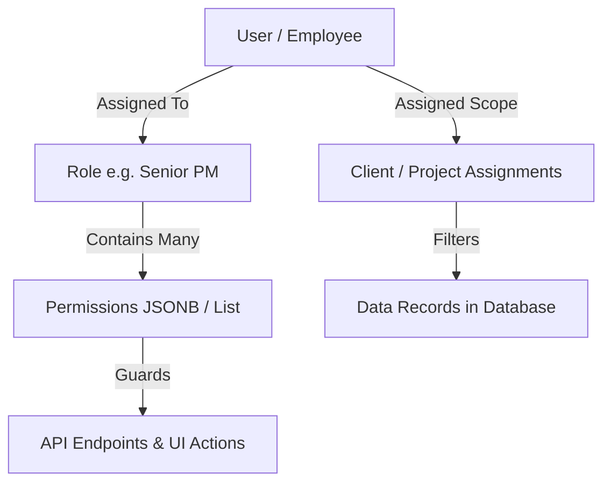
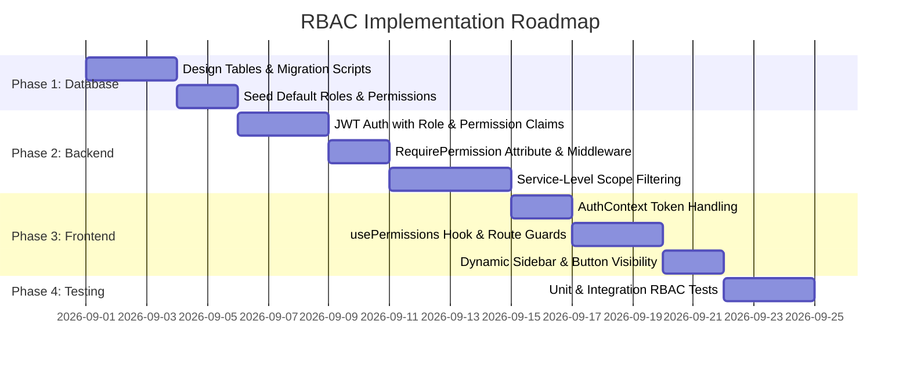

# Role-Based Access Control (RBAC) Architecture & Implementation Guide
## TrackerPro (PMS) Complete Blueprint

> **Notice:** This document is an architectural blueprint and technical guide. No application code has been modified.

---

## 1. Overview & Core Philosophy

Role-Based Access Control (RBAC) restricts system access based on the roles assigned to individual users. In **TrackerPro**, a hybrid model combining **RBAC**, **Fine-Grained Permissions (PBAC)**, and **Resource-Level Scoping** is used:

1. **User**: The entity logging into the system (e.g., employee with an email and password).
2. **Role**: A named collection of permissions (e.g., `SeniorPm`, `Pmo`, `ProjectManager`, `Hr`, `Admin`).
3. **Permission**: A fine-grained atomic privilege (e.g., `clients:read`, `timesheets:approve`, `resources:manage`).
4. **Data Scope**: Contextual ownership boundary (e.g., a Senior PM only sees projects under their assigned clients, while PMO has global visibility across all 10+ clients).



---

## 2. Database Design & Required Tables

To implement robust RBAC with support for system defaults and custom dynamic roles, the database requires the following schema in PostgreSQL:

### Database Schema (PostgreSQL DDL)

```sql
-- ============================================================================
-- 1. ROLES TABLE
-- ============================================================================
CREATE TABLE IF NOT EXISTS roles (
    id UUID PRIMARY KEY DEFAULT gen_random_uuid(),
    name VARCHAR(50) NOT NULL UNIQUE,          -- Machine key: 'senior_pm', 'pmo', 'admin'
    display_name VARCHAR(100) NOT NULL,        -- User-friendly: 'Senior Project Manager'
    description TEXT,
    is_system_role BOOLEAN NOT NULL DEFAULT FALSE, -- System roles cannot be deleted
    is_active BOOLEAN NOT NULL DEFAULT TRUE,
    permissions JSONB NOT NULL DEFAULT '[]'::jsonb, -- Array of permission strings
    created_at TIMESTAMPTZ NOT NULL DEFAULT CURRENT_TIMESTAMP,
    updated_at TIMESTAMPTZ NOT NULL DEFAULT CURRENT_TIMESTAMP,
    created_by UUID,
    updated_by UUID,
    is_deleted BOOLEAN NOT NULL DEFAULT FALSE
);

CREATE INDEX idx_roles_name ON roles(name);
CREATE INDEX idx_roles_permissions ON roles USING GIN(permissions);

-- ============================================================================
-- 2. USERS TABLE (Integrated with Roles)
-- ============================================================================
CREATE TABLE IF NOT EXISTS users (
    id UUID PRIMARY KEY DEFAULT gen_random_uuid(),
    employee_code VARCHAR(20) UNIQUE,
    email VARCHAR(255) NOT NULL UNIQUE,
    password_hash VARCHAR(255) NOT NULL,
    first_name VARCHAR(100) NOT NULL,
    last_name VARCHAR(100) NOT NULL,
    phone_number VARCHAR(20),
    role_id UUID NOT NULL REFERENCES roles(id) ON DELETE RESTRICT,
    department VARCHAR(100),
    designation VARCHAR(100),
    is_active BOOLEAN NOT NULL DEFAULT TRUE,
    last_login_at TIMESTAMPTZ,
    refresh_token_hash VARCHAR(255),
    refresh_token_expiry TIMESTAMPTZ,
    created_at TIMESTAMPTZ NOT NULL DEFAULT CURRENT_TIMESTAMP,
    updated_at TIMESTAMPTZ NOT NULL DEFAULT CURRENT_TIMESTAMP,
    created_by UUID,
    updated_by UUID,
    is_deleted BOOLEAN NOT NULL DEFAULT FALSE
);

CREATE INDEX idx_users_email ON users(email);
CREATE INDEX idx_users_role_id ON users(role_id);

-- ============================================================================
-- 3. DATA SCOPE ASSIGNMENTS (For SPM / EM / PM scoping)
-- ============================================================================
CREATE TABLE IF NOT EXISTS user_client_assignments (
    id UUID PRIMARY KEY DEFAULT gen_random_uuid(),
    user_id UUID NOT NULL REFERENCES users(id) ON DELETE CASCADE,
    client_id UUID NOT NULL REFERENCES mst_client(client_id) ON DELETE CASCADE,
    role_type VARCHAR(50) NOT NULL, -- 'SPM', 'EM', 'SalesLead'
    assigned_at TIMESTAMPTZ NOT NULL DEFAULT CURRENT_TIMESTAMP,
    assigned_by UUID,
    CONSTRAINT uq_user_client UNIQUE (user_id, client_id, role_type)
);

CREATE TABLE IF NOT EXISTS project_members (
    id UUID PRIMARY KEY DEFAULT gen_random_uuid(),
    project_id UUID NOT NULL REFERENCES trn_project(project_id) ON DELETE CASCADE,
    user_id UUID NOT NULL REFERENCES users(id) ON DELETE CASCADE,
    project_role VARCHAR(50) NOT NULL, -- 'ProjectManager', 'TeamLead', 'Developer'
    allocation_percentage NUMERIC(5,2) DEFAULT 100.00,
    start_date DATE NOT NULL,
    end_date DATE,
    is_active BOOLEAN DEFAULT TRUE,
    created_at TIMESTAMPTZ NOT NULL DEFAULT CURRENT_TIMESTAMP
);

-- ============================================================================
-- 4. ROLE PERMISSION AUDIT LOG (Tracks who edited what permission)
-- ============================================================================
CREATE TABLE IF NOT EXISTS role_permission_audits (
    id UUID PRIMARY KEY DEFAULT gen_random_uuid(),
    role_id UUID NOT NULL REFERENCES roles(id) ON DELETE CASCADE,
    action_type VARCHAR(20) NOT NULL, -- 'CREATED', 'UPDATED', 'RESET'
    previous_permissions JSONB,
    new_permissions JSONB NOT NULL,
    changed_by UUID NOT NULL REFERENCES users(id),
    changed_at TIMESTAMPTZ NOT NULL DEFAULT CURRENT_TIMESTAMP,
    change_reason TEXT
);
```

---

## 3. TrackerPro Role & Permission Matrix

### Permission Keys Hierarchy

| Domain | Permission Key | Description |
| :--- | :--- | :--- |
| **Clients** | `clients:read` | View clients list and summary details |
| | `clients:write` | Create and edit client information |
| | `clients:approve` | Approve new clients or contracts |
| **Projects** | `projects:read` | View assigned or all projects |
| | `projects:write` | Create, edit projects, stages & milestones |
| | `projects:close` | Formal project sign-off and closure |
| **WBS** | `wbs:read` | View Work Breakdown Structure |
| | `wbs:allocate` | Allocate PM, SPM, EM, and tech stack |
| **Timesheets** | `timesheets:submit` | Submit weekly hours / task logs |
| | `timesheets:approve`| Approve/Reject submitted timesheets |
| | `timesheets:monitor`| Read-only audit view of all company timesheets |
| **Resources** | `resources:read` | View employee directory and bench status |
| | `resources:manage` | Onboard, offboard, edit employee skills/roles |
| **Finance** | `invoices:raise` | Generate and issue milestone invoices |
| | `invoices:payment` | Mark invoice paid / record payments |
| **Admin** | `users:manage` | Manage users and password resets |
| | `roles:manage` | Edit role permissions and dynamic roles |

### Baseline Role Assignments Matrix

| System Role | Scope | Key Permissions Included |
| :--- | :--- | :--- |
| **Admin / Dhanshree** | Global (All) | Full access (`*`) to all modules, billing, config, users, roles |
| **PMO** | Global (All) | `wbs:read`, `wbs:allocate`, `resources:read`, `timesheets:monitor`, `projects:read`, `clients:read` |
| **HOD** | Department | `projects:read`, `resources:read`, `timesheets:approve` (SPM/EM level), `reports:read` |
| **Business Owner** | Global (All) | `projects:read`, `clients:read`, `reports:read`, `invoices:read` (Executive view) |
| **Senior PM (SPM)** | Assigned Clients | `projects:read`, `projects:write`, `timesheets:approve` (PM level), `issues:manage` |
| **Engagement Mgr** | Assigned Clients | `clients:read`, `clients:write`, `projects:read`, `timesheets:approve` |
| **Project Manager** | Assigned Projects | `projects:read`, `projects:write`, `wbs:read`, `timesheets:approve` (Team level) |
| **Team Lead / Dev** | Assigned Tasks | `timesheets:submit`, `projects:read` (Task board view only) |
| **HR** | Global (Staff) | `resources:read`, `resources:manage`, `audit:read` |
| **Accounts / Sales** | Global (Billing) | `invoices:raise`, `invoices:payment`, `clients:read`, `clients:write` |

---

## 4. Backend Implementation Plan (.NET 10 Web API)

### 4.1. JWT Token Payload (Authentication)
When a user logs in via `/api/v1/auth/login`, the backend issues a JWT containing their claims:

```json
{
  "sub": "b2c9df73-...",
  "email": "aarav.mehta@trackerpro.com",
  "name": "Aarav Mehta",
  "role": "SeniorPm",
  "permissions": [
    "clients:read",
    "projects:read",
    "projects:write",
    "timesheets:approve",
    "issues:manage"
  ],
  "client_ids": ["c1", "c2", "c3"],
  "exp": 1756644000
}
```

### 4.2. Declarative Controller Protection
Guard controllers and endpoints with custom attributes:

```csharp
[ApiController]
[Route("api/v1/projects")]
[Authorize]
public class ProjectsController : ControllerBase
{
    [HttpGet]
    [RequirePermission(Permissions.ProjectsRead)]
    public async Task<IActionResult> GetProjects()
    {
        // Query will be scoped to user's assigned clients if SPM/EM
        var projects = await _projectService.GetProjectsForCurrentUserAsync();
        return Ok(projects);
    }

    [HttpPost]
    [RequirePermission(Permissions.ProjectsWrite)]
    public async Task<IActionResult> CreateProject([FromBody] CreateProjectRequest request)
    {
        var result = await _projectService.CreateProjectAsync(request);
        return CreatedAtAction(nameof(GetProjects), new { id = result.Id }, result);
    }
}
```

### 4.3. Data Scoping in Services (Row-Level Security)
Ensure users only see data they are authorized to access:

```csharp
public async Task<List<ProjectDto>> GetProjectsForCurrentUserAsync()
{
    var currentUserId = _currentUserService.UserId;
    var userRole = _currentUserService.Role;

    IQueryable<Project> query = _db.Projects.Include(p => p.Client);

    // Global roles see everything
    if (userRole is UserRole.Admin or UserRole.Pmo or UserRole.Hod or UserRole.BusinessOwner)
    {
        return await query.Select(p => p.ToDto()).ToListAsync();
    }

    // Senior PM and Engagement Manager: Scoped to assigned clients
    if (userRole is UserRole.SeniorPm or UserRole.EngagementManager)
    {
        var assignedClientIds = await _db.UserClientAssignments
            .Where(a => a.UserId == currentUserId)
            .Select(a => a.ClientId)
            .ToListAsync();

        query = query.Where(p => assignedClientIds.Contains(p.ClientId));
    }
    // Project Manager / Developer: Scoped to assigned projects
    else
    {
        var assignedProjectIds = await _db.ProjectMembers
            .Where(m => m.UserId == currentUserId && m.IsActive)
            .Select(m => m.ProjectId)
            .ToListAsync();

        query = query.Where(p => assignedProjectIds.Contains(p.ProjectId));
    }

    return await query.Select(p => p.ToDto()).ToListAsync();
}
```

---

## 5. Frontend Implementation Plan (React + TanStack Router)

### 5.1. Permission Hook (`usePermissions`)
Provide a clean helper hook to check permissions across components:

```tsx
// lib/permissions.ts
import { useAuth } from "@/lib/auth-context";

export function usePermissions() {
  const { user } = useAuth();

  const permissions = user?.permissions ?? [];

  const can = (permissionKey: string): boolean => {
    if (user?.role === "Admin") return true; // Super admin override
    return permissions.includes(permissionKey);
  };

  const canAny = (keys: string[]): boolean => {
    if (user?.role === "Admin") return true;
    return keys.some((k) => permissions.includes(k));
  };

  const isRole = (role: string): boolean => {
    return user?.role === role;
  };

  return { can, canAny, isRole, role: user?.role };
}
```

### 5.2. Component-Level Authorization Wrapper
Conditionally render buttons and action triggers:

```tsx
// components/authorize.tsx
import { ReactNode } from "react";
import { usePermissions } from "@/lib/permissions";

interface AuthorizeProps {
  permission?: string;
  role?: string;
  fallback?: ReactNode;
  children: ReactNode;
}

export function Authorize({ permission, role, fallback = null, children }: AuthorizeProps) {
  const { can, isRole } = usePermissions();

  if (permission && !can(permission)) return <>{fallback}</>;
  if (role && !isRole(role)) return <>{fallback}</>;

  return <>{children}</>;
}
```

**Usage Example in UI:**
```tsx
<Authorize permission="projects:write">
  <Button onClick={() => openCreateModal()}>
    <Plus className="mr-2 h-4 w-4" /> Create Project
  </Button>
</Authorize>
```

### 5.3. Route Guarding with TanStack Router
Prevent unauthorized URL navigation:

```tsx
// routes/wbs-allocation.tsx
import { createFileRoute, redirect } from "@tanstack/react-router";

export const Route = createFileRoute("/wbs-allocation")({
  beforeLoad: ({ context }) => {
    const { auth } = context;
    if (!auth.isAuthenticated) {
      throw redirect({ to: "/login" });
    }
    if (!auth.user?.permissions.includes("wbs:allocate") && auth.user?.role !== "Admin") {
      throw redirect({ to: "/unauthorized" });
    }
  },
  component: WbsAllocationPage,
});
```

### 5.4. Dynamic Navigation Filtering
Filter navigation items in `app-sidebar.tsx` so users only see links to modules they have access to:

```tsx
const navItems = [
  { title: "Dashboard", href: "/dashboard", permission: "dashboard:read" },
  { title: "Clients & Projects", href: "/projects", permission: "projects:read" },
  { title: "WBS Allocation", href: "/wbs-allocation", permission: "wbs:allocate" },
  { title: "Resources", href: "/resources", permission: "resources:read" },
  { title: "Approvals", href: "/approvals", permission: "timesheets:approve" },
  { title: "Role Management", href: "/settings/roles", permission: "roles:manage" },
].filter(item => can(item.permission));
```

---

## 6. Implementation Step-by-Step Roadmap



1. **Phase 1: Database Setup**
   - Create `roles`, `users`, `user_client_assignments`, and `role_permission_audits` tables.
   - Run seed script with all 12 TrackerPro system roles and baseline permissions.

2. **Phase 2: Backend Authentication & Authorization**
   - Implement login API (`/api/v1/auth/login`) generating JWT tokens with permission claims.
   - Attach `[RequirePermission(...)]` filter to all API controllers.
   - Add scoping queries to ensure data isolation (clients/projects).

3. **Phase 3: Frontend Permissions & UI**
   - Store JWT token securely.
   - Implement `usePermissions()` and `<Authorize>` components.
   - Protect TanStack Router routes and filter sidebar menu items.

4. **Phase 4: Role Management UI (Admin Console)**
   - Create a Role Management dashboard where Admins can create custom roles, toggle permissions per role, and view audit history.
