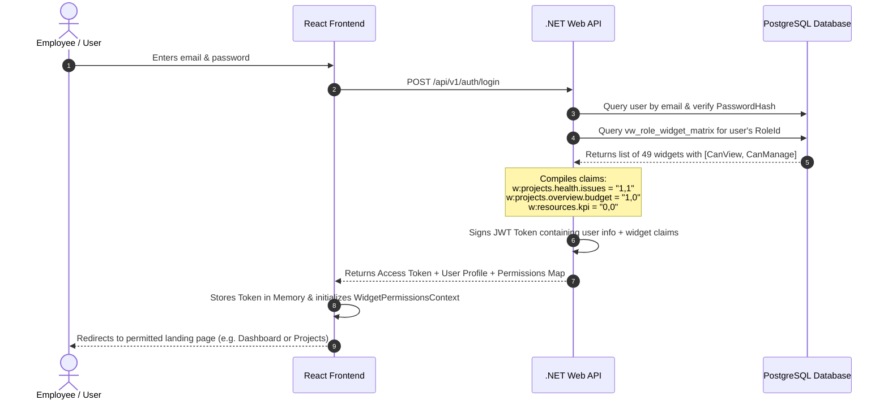
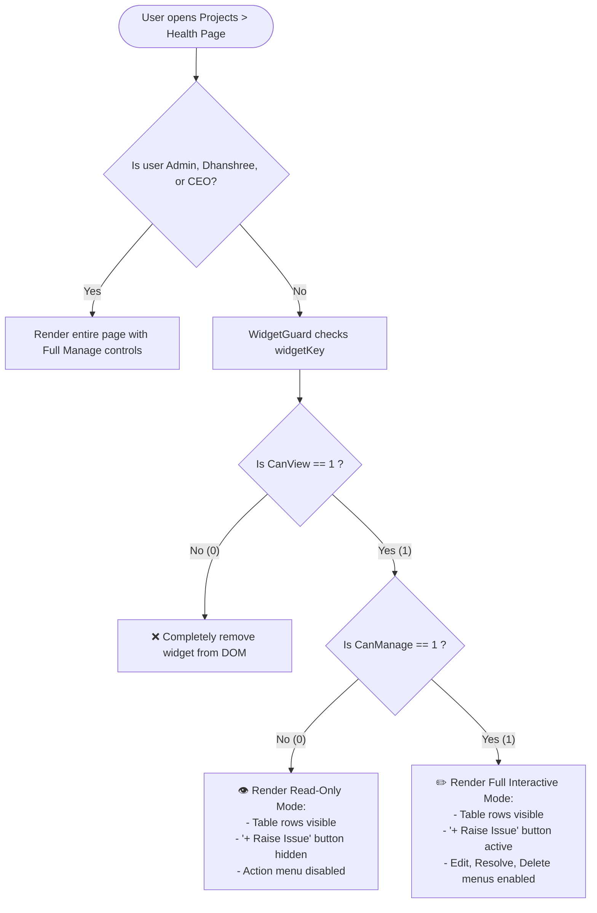
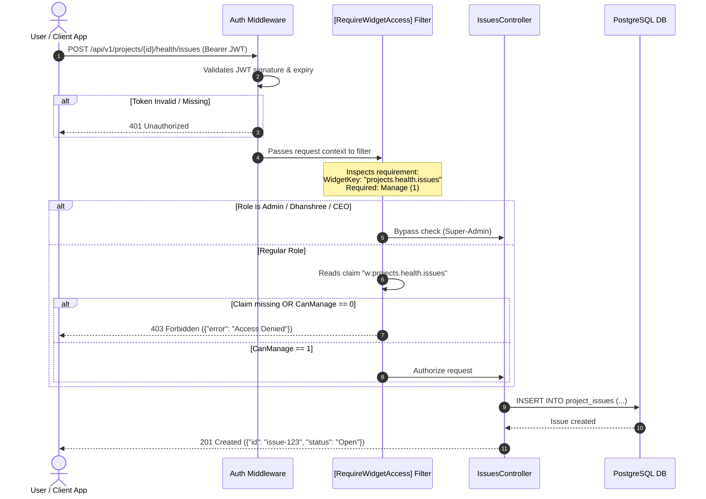
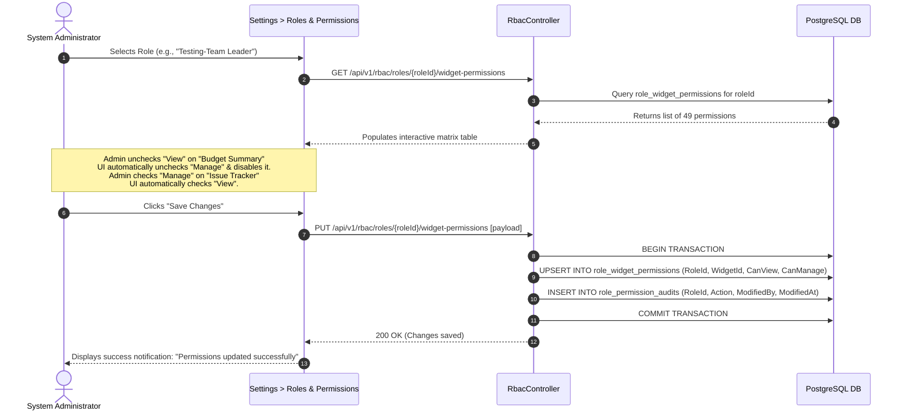
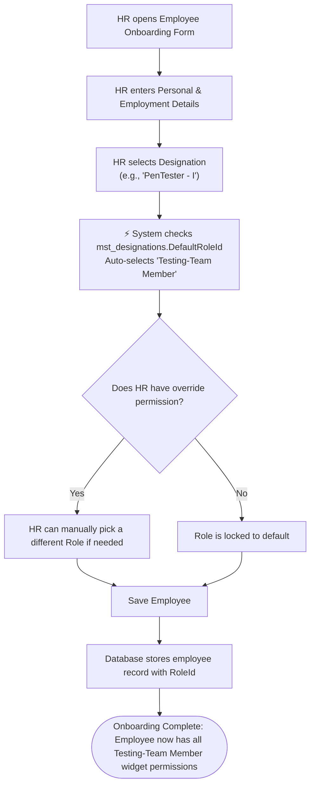
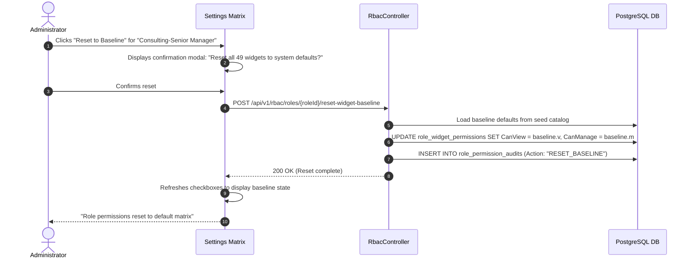

# RBAC Workflows & Lifecycle Guide
## TrackerPro / Pulse PMO — Visual Flow & Architecture Walkthrough

This document explains **how Role-Based Access Control (RBAC) works from end to end** across TrackerPro. It details the journey of a user from login to UI rendering, API protection, administrative customization, and employee onboarding.

---

## Table of Contents
1. [Core Conceptual Model (Role → Module → Submodule → Widget)](#1-core-conceptual-model)
2. [Workflow 1: User Login & Permission Extraction](#2-workflow-1-user-login--permission-extraction)
3. [Workflow 2: UI Rendering & Widget Display (Frontend Guard)](#3-workflow-2-ui-rendering--widget-display-frontend-guard)
4. [Workflow 3: API Request Protection (Backend Guard)](#4-workflow-3-api-request-protection-backend-guard)
5. [Workflow 4: Admin Customizes Role Permissions (Settings Matrix)](#5-workflow-4-admin-customizes-role-permissions-settings-matrix)
6. [Workflow 5: Employee Onboarding & Auto-Role Assignment](#6-workflow-5-employee-onboarding--auto-role-assignment)
7. [Workflow 6: Reset Role to Baseline Defaults](#7-workflow-6-reset-role-to-baseline-defaults)
8. [Real-World Persona Walkthroughs (Side-by-Side Comparison)](#8-real-world-persona-walkthroughs)

---

## 1. Core Conceptual Model

Access control in TrackerPro operates on a **4-tier hierarchy** with **binary flags (1 or 0)** stored in the database:

```
┌────────────────────────────────────────────────────────┐
│                        1. ROLE                         │
│       (e.g., Testing-Manager, PMO, Consulting-TL)      │
└───────────────────────────┬────────────────────────────┘
                            │ has many
                            ▼
┌────────────────────────────────────────────────────────┐
│                       2. MODULE                        │
│         (e.g., Projects, Resources, Customers)         │
└───────────────────────────┬────────────────────────────┘
                            │ contains
                            ▼
┌────────────────────────────────────────────────────────┐
│                     3. SUB-MODULE                      │
│     (e.g., Overview, Health & Governance, Budget)      │
└───────────────────────────┬────────────────────────────┘
                            │ contains
                            ▼
┌────────────────────────────────────────────────────────┐
│                       4. WIDGET                        │
│   (e.g., Issue Tracker, KPI Summary, Extension Req)    │
└───────────────────────────┬────────────────────────────┘
                            │ evaluated to
                            ▼
         ┌──────────────────────────────────────┐
         │       5. BINARY PERMISSIONS (1 / 0)  │
         │  CanView: 0 or 1  |  CanManage: 0 or 1│
         └──────────────────────────────────────┘
```

### The Three State Matrix

| State | `CanView` | `CanManage` | User Experience & UI Behavior | Backend API Enforcement |
| :--- | :---: | :---: | :--- | :--- |
| **Hidden** | `0` | `0` | Widget does **not render** at all in the DOM. Navigation link is hidden. | All Read and Write API endpoints return `403 Forbidden`. |
| **Read-Only** | `1` | `0` | Widget **displays data** (cards, charts, tables), but "Create", "Edit", "Delete", "Upload", and "Assign" buttons are hidden/disabled. | GET requests succeed `200 OK`. POST/PUT/DELETE requests return `403 Forbidden`. |
| **Full Manage** | `1` | `1` | Widget is **fully interactive**. All buttons, modals, dropdowns, and forms are enabled. | GET, POST, PUT, DELETE requests all succeed `200 OK`. |

> **Universal Rule**: `CanManage = 1` requires `CanView = 1`. A user can never edit something they are not allowed to view.

---

## 2. Workflow 1: User Login & Permission Extraction

When a user signs in, the system resolves their role and compiles their complete widget permissions into their authentication session.



---

## 3. Workflow 2: UI Rendering & Widget Display (Frontend Guard)

When a page loads (for example, `Projects > Health & Governance`), the `<WidgetGuard />` component evaluates the user's permissions for each individual section.



### Visual Code Pattern:
```tsx
<WidgetGuard widgetKey="projects.health.issues">
  {({ canManage }) => (
    <div className="card">
      <div className="header">
        <h3>Project Issues</h3>
        {/* Only rendered if canManage === true */}
        {canManage && <button onClick={openNewIssueModal}>+ Raise Issue</button>}
      </div>

      {/* Rendered because canView === true */}
      <IssuesTable readOnly={!canManage} />
    </div>
  )}
</WidgetGuard>
```

---

## 4. Workflow 3: API Request Protection (Backend Guard)

Frontend hiding is purely for user experience. True security is enforced at the backend controller level using declarative attributes.



---

## 5. Workflow 4: Admin Customizes Role Permissions (Settings Matrix)

An administrator can change the permissions of any role in real-time through the Settings UI without touching database code.



---

## 6. Workflow 5: Employee Onboarding & Auto-Role Assignment

When a new employee joins, their technical designation automatically links them to the correct RBAC role.



---

## 7. Workflow 6: Reset Role to Baseline Defaults

If custom permission changes cause confusion or mistakes, an administrator can instantly restore the system baseline.



---

## 8. Real-World Persona Walkthroughs

Here is what three different users experience when navigating to the **exact same page**: `Projects > Project Details`:

### Page: `Projects > Health & Governance Tab`

| Widget / Component | Intern (`Intern`) | Testing Project Manager (`Testing-Manager`) | Admin (`Admin` / `Dhanshree`) |
| :--- | :---: | :---: | :---: |
| **Health Summary KPI** | 👁️ **View Only** (`1, 0`) | 👁️ **View Only** (`1, 0`) | 👁️ **View Only** (`1, 0`) |
| **Issue Tracker** | 👁️ **View Only** (`1, 0`)<br>*(Can read issues, cannot raise)* | ✏️ **Full Manage** (`1, 1`)<br>*(Can raise, edit, resolve issues)* | ✏️ **Full Manage** (`1, 1`)<br>*(Full unrestricted control)* |
| **Alerts Banner** | 👁️ **View Only** (`1, 0`) | ✏️ **Full Manage** (`1, 1`) | ✏️ **Full Manage** (`1, 1`) |
| **Escalation Matrix** | ❌ **Hidden** (`0, 0`)<br>*(Section omitted from page)* | 👁️ **View Only** (`1, 0`) | ✏️ **Full Manage** (`1, 1`) |
| **Customer Engagement** | ❌ **Hidden** (`0, 0`) | ✏️ **Full Manage** (`1, 1`) | ✏️ **Full Manage** (`1, 1`) |

---

### Page: `Projects > Overview Tab`

| Widget / Component | Intern (`Intern`) | Testing Project Manager (`Testing-Manager`) | Admin (`Admin` / `Dhanshree`) |
| :--- | :---: | :---: | :---: |
| **Project Details Card** | 👁️ **View Only** (`1, 0`) | 👁️ **View Only** (`1, 0`) | ✏️ **Full Manage** (`1, 1`) |
| **Budget & Financials** | ❌ **Hidden** (`0, 0`)<br>*(Budget block completely hidden)* | ❌ **Hidden** (`0, 0`)<br>*(Budget hidden from QA PM)* | ✏️ **Full Manage** (`1, 1`)<br>*(Full financial visibility & edit)* |
| **Extension Request** | ❌ **Hidden** (`0, 0`) | ✏️ **Full Manage** (`1, 1`)<br>*(Can submit extension requests)* | ✏️ **Full Manage** (`1, 1`) |
| **Reassign PM / TL** | ❌ **Hidden** (`0, 0`) | ❌ **Hidden** (`0, 0`) | ✏️ **Full Manage** (`1, 1`)<br>*(Only Executive / PMO can reassign)* |

---

## 9. Summary of Key Architectural Guarantees

1. **Defense in Depth**: Access is checked twice—once on the frontend (for clean UX and hiding buttons) and once on the backend (for security and blocking unauthorized API calls).
2. **Zero Invalidation Risk**: The database constraint `chk_manage_requires_view` guarantees that data corruption (having write permission without read permission) can never occur.
3. **No Hard-Coded Roles in Page Logic**: Pages check `useWidgetAccess("widget_key")` instead of checking `if (user.role === "PM")`. This allows any role's access to be reconfigured by an admin at any time without changing frontend code.
4. **Audit Trail**: Every toggle or baseline reset is recorded in `role_permission_audits` with who changed it, the exact timestamp, and what values changed.
