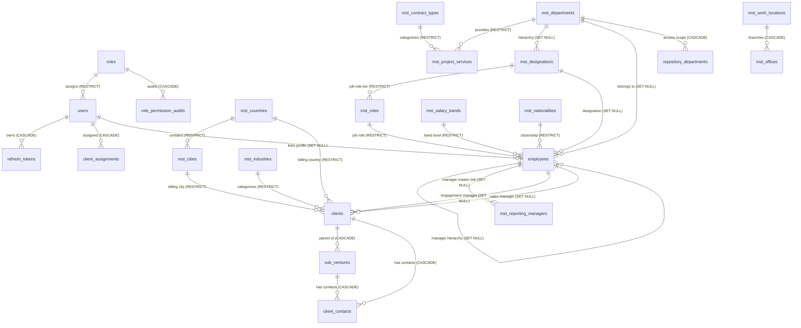

# Complete Settings & Masters Database Specification (with Cross-Module Dependencies)

This document provides the exhaustive database schema for **Settings & Masters Management** in **TrackerPro / Pulse PMO**, including all cross-module foreign key constraints, referential actions (`ON DELETE`), cascade rules, indexing strategies, and ER diagrams.

---

## 1. System Architecture & Cross-Module Dependency Map

Masters and Settings serve as the operational backbone for all modules in TrackerPro:



---

## 2. Global Base Entity Audit & Soft-Delete Standards

Every table in the database includes standard audit and soft-delete columns via the `BaseEntity` contract:

| Column | Data Type | Nullable | Default | Description |
| :--- | :--- | :--- | :--- | :--- |
| `Id` | `UUID` | NO | `gen_random_uuid()` | Primary Key |
| `CreatedAtUtc` | `TIMESTAMPTZ` | NO | `now()` | Record creation timestamp |
| `UpdatedAtUtc` | `TIMESTAMPTZ` | YES | `NULL` | Timestamp of latest modification |
| `CreatedBy` | `UUID` | YES | `NULL` | Foreign key referencing `users.Id` |
| `UpdatedBy` | `UUID` | YES | `NULL` | Foreign key referencing `users.Id` |
| `DeletedAtUtc` | `TIMESTAMPTZ` | YES | `NULL` | Soft-delete flag (`NULL` = Active, Timestamp = Soft Deleted) |

---

## 3. Detailed Schemas by Domain & Module Dependencies

---

### Module 1: Security & RBAC Settings

#### Table: `roles`
Stores application roles and their permission matrix as a JSONB array of keys.
- **Inbound Dependencies**: None
- **Outbound Dependencies**: Referenced by `users.RoleId` (`ON DELETE RESTRICT`) and `role_permission_audits.RoleId` (`ON DELETE CASCADE`).

```sql
CREATE TABLE IF NOT EXISTS roles (
    "Id" UUID PRIMARY KEY DEFAULT gen_random_uuid(),
    "Name" VARCHAR(100) NOT NULL UNIQUE,
    "DisplayName" VARCHAR(150) NOT NULL,
    "Description" VARCHAR(500),
    "IsSystemRole" BOOLEAN NOT NULL DEFAULT false,
    "IsActive" BOOLEAN NOT NULL DEFAULT true,
    "Permissions" JSONB NOT NULL DEFAULT '[]'::jsonb,
    "CreatedAtUtc" TIMESTAMPTZ NOT NULL DEFAULT now(),
    "UpdatedAtUtc" TIMESTAMPTZ,
    "CreatedBy" UUID REFERENCES users("Id") ON DELETE SET NULL,
    "UpdatedBy" UUID REFERENCES users("Id") ON DELETE SET NULL,
    "DeletedAtUtc" TIMESTAMPTZ
);

CREATE INDEX IF NOT EXISTS "IX_roles_IsActive" ON roles ("IsActive");
CREATE INDEX IF NOT EXISTS "IX_roles_Permissions" ON roles USING gin ("Permissions");
```

#### Table: `role_permission_audits`
Audit trail of granular permission changes for compliance and security review.
- **Dependencies**: `RoleId` $\rightarrow$ `roles.Id` (`ON DELETE CASCADE`), `ModifiedBy` $\rightarrow$ `users.Id` (`ON DELETE SET NULL`).

```sql
CREATE TABLE IF NOT EXISTS role_permission_audits (
    "Id" UUID PRIMARY KEY DEFAULT gen_random_uuid(),
    "RoleId" UUID NOT NULL REFERENCES roles("Id") ON DELETE CASCADE,
    "Action" VARCHAR(50) NOT NULL,
    "PermissionsBefore" JSONB NOT NULL DEFAULT '[]'::jsonb,
    "PermissionsAfter" JSONB NOT NULL DEFAULT '[]'::jsonb,
    "ModifiedBy" UUID REFERENCES users("Id") ON DELETE SET NULL,
    "ModifiedAtUtc" TIMESTAMPTZ NOT NULL DEFAULT now(),
    "Reason" VARCHAR(500),
    "CreatedAtUtc" TIMESTAMPTZ NOT NULL DEFAULT now(),
    "UpdatedAtUtc" TIMESTAMPTZ,
    "CreatedBy" UUID REFERENCES users("Id") ON DELETE SET NULL,
    "UpdatedBy" UUID REFERENCES users("Id") ON DELETE SET NULL,
    "DeletedAtUtc" TIMESTAMPTZ
);

CREATE INDEX IF NOT EXISTS "IX_role_permission_audits_RoleId" ON role_permission_audits ("RoleId");
```

---

### Module 2: Project Masters & Deliverable Catalog

#### Table: `mst_contract_types`
Commercial contract models (e.g., Time & Materials, Fixed Bid, Scope Based, Retainer).
- **Outbound Dependencies**: Referenced by `mst_project_services.ContractTypeId` (`ON DELETE RESTRICT`).

```sql
CREATE TABLE IF NOT EXISTS mst_contract_types (
    "Id" UUID PRIMARY KEY DEFAULT gen_random_uuid(),
    "Code" VARCHAR(80) NOT NULL UNIQUE,
    "Name" VARCHAR(150) NOT NULL UNIQUE,
    "Description" VARCHAR(500),
    "IsActive" BOOLEAN NOT NULL DEFAULT true,
    "SortOrder" INT NOT NULL DEFAULT 0,
    "CreatedAtUtc" TIMESTAMPTZ NOT NULL DEFAULT now(),
    "UpdatedAtUtc" TIMESTAMPTZ,
    "CreatedBy" UUID REFERENCES users("Id") ON DELETE SET NULL,
    "UpdatedBy" UUID REFERENCES users("Id") ON DELETE SET NULL,
    "DeletedAtUtc" TIMESTAMPTZ
);
```

#### Table: `mst_project_services`
Project deliverable catalog mapping department offerings, toolstacks, expected durations, and billing rates.
- **Dependencies**:
  - `ContractTypeId` $\rightarrow$ `mst_contract_types.Id` (`ON DELETE RESTRICT`)
  - `DepartmentId` $\rightarrow$ `mst_departments.Id` (`ON DELETE RESTRICT`)

```sql
CREATE TABLE IF NOT EXISTS mst_project_services (
    "Id" UUID PRIMARY KEY DEFAULT gen_random_uuid(),
    "ContractTypeId" UUID REFERENCES mst_contract_types("Id") ON DELETE RESTRICT,
    "DepartmentId" UUID NOT NULL REFERENCES mst_departments("Id") ON DELETE RESTRICT,
    "ServiceName" VARCHAR(200) NOT NULL,
    "Tools" VARCHAR(300),
    "Duration" VARCHAR(100),
    "StandardDurationDays" INT,
    "UnitPrice" NUMERIC(14, 2) NOT NULL DEFAULT 0.00,
    "Currency" VARCHAR(10) NOT NULL DEFAULT 'USD',
    "IsActive" BOOLEAN NOT NULL DEFAULT true,
    "CreatedAtUtc" TIMESTAMPTZ NOT NULL DEFAULT now(),
    "UpdatedAtUtc" TIMESTAMPTZ,
    "CreatedBy" UUID REFERENCES users("Id") ON DELETE SET NULL,
    "UpdatedBy" UUID REFERENCES users("Id") ON DELETE SET NULL,
    "DeletedAtUtc" TIMESTAMPTZ
);

CREATE UNIQUE INDEX IF NOT EXISTS "IX_mst_project_services_Unique" 
ON mst_project_services ("ContractTypeId", "DepartmentId", "ServiceName") 
WHERE "DeletedAtUtc" IS NULL;
```

---

### Module 3: Customer & Geographical Masters

#### Table: `mst_industries`
Business domain classification for clients.
- **Outbound Dependencies**: Referenced by `clients.IndustryId` (`ON DELETE RESTRICT`).

```sql
CREATE TABLE IF NOT EXISTS mst_industries (
    "Id" UUID PRIMARY KEY DEFAULT gen_random_uuid(),
    "Code" VARCHAR(80) NOT NULL UNIQUE,
    "Name" VARCHAR(150) NOT NULL UNIQUE,
    "IsActive" BOOLEAN NOT NULL DEFAULT true,
    "CreatedAtUtc" TIMESTAMPTZ NOT NULL DEFAULT now(),
    "UpdatedAtUtc" TIMESTAMPTZ,
    "CreatedBy" UUID REFERENCES users("Id") ON DELETE SET NULL,
    "UpdatedBy" UUID REFERENCES users("Id") ON DELETE SET NULL,
    "DeletedAtUtc" TIMESTAMPTZ
);
```

#### Table: `mst_countries`
Global country directory with ISO codes and currency symbols.
- **Outbound Dependencies**: Referenced by `mst_cities.CountryId` (`ON DELETE RESTRICT`), `clients.CountryId` (`ON DELETE RESTRICT`), `employees.NationalityId` (`ON DELETE RESTRICT`).

```sql
CREATE TABLE IF NOT EXISTS mst_countries (
    "Id" UUID PRIMARY KEY DEFAULT gen_random_uuid(),
    "Code" VARCHAR(80) NOT NULL UNIQUE,
    "Name" VARCHAR(150) NOT NULL UNIQUE,
    "Iso2" VARCHAR(2),
    "Iso3" VARCHAR(3),
    "PhoneCode" VARCHAR(10),
    "Currency" VARCHAR(10),
    "IsActive" BOOLEAN NOT NULL DEFAULT true,
    "CreatedAtUtc" TIMESTAMPTZ NOT NULL DEFAULT now(),
    "UpdatedAtUtc" TIMESTAMPTZ,
    "CreatedBy" UUID REFERENCES users("Id") ON DELETE SET NULL,
    "UpdatedBy" UUID REFERENCES users("Id") ON DELETE SET NULL,
    "DeletedAtUtc" TIMESTAMPTZ
);
```

#### Table: `mst_cities`
City directory linked to sovereign country masters.
- **Dependencies**: `CountryId` $\rightarrow$ `mst_countries.Id` (`ON DELETE RESTRICT`).
- **Outbound Dependencies**: Referenced by `clients.CityId` (`ON DELETE RESTRICT`).

```sql
CREATE TABLE IF NOT EXISTS mst_cities (
    "Id" UUID PRIMARY KEY DEFAULT gen_random_uuid(),
    "Code" VARCHAR(80) NOT NULL,
    "Name" VARCHAR(150) NOT NULL,
    "CountryId" UUID NOT NULL REFERENCES mst_countries("Id") ON DELETE RESTRICT,
    "IsActive" BOOLEAN NOT NULL DEFAULT true,
    "CreatedAtUtc" TIMESTAMPTZ NOT NULL DEFAULT now(),
    "UpdatedAtUtc" TIMESTAMPTZ,
    "CreatedBy" UUID REFERENCES users("Id") ON DELETE SET NULL,
    "UpdatedBy" UUID REFERENCES users("Id") ON DELETE SET NULL,
    "DeletedAtUtc" TIMESTAMPTZ
);

CREATE INDEX IF NOT EXISTS "IX_mst_cities_CountryId" ON mst_cities ("CountryId");
```

#### Table: `mst_contact_types`
Stakeholder classification (e.g., Primary Contact, Billing Lead, Escalation POC).
- **Outbound Dependencies**: Referenced by `client_contacts.ContactType`.

```sql
CREATE TABLE IF NOT EXISTS mst_contact_types (
    "Id" UUID PRIMARY KEY DEFAULT gen_random_uuid(),
    "Code" VARCHAR(80) NOT NULL UNIQUE,
    "Name" VARCHAR(150) NOT NULL UNIQUE,
    "Description" VARCHAR(500),
    "IsActive" BOOLEAN NOT NULL DEFAULT true,
    "CreatedAtUtc" TIMESTAMPTZ NOT NULL DEFAULT now(),
    "UpdatedAtUtc" TIMESTAMPTZ,
    "CreatedBy" UUID REFERENCES users("Id") ON DELETE SET NULL,
    "UpdatedBy" UUID REFERENCES users("Id") ON DELETE SET NULL,
    "DeletedAtUtc" TIMESTAMPTZ
);
```

---

### Module 4: Resource & Organization Masters

#### Table: `mst_departments`
Organizational business and delivery units.
- **Outbound Dependencies**:
  - `mst_designations.DepartmentId` (`ON DELETE SET NULL`)
  - `employees.DepartmentId` (`ON DELETE SET NULL`)
  - `mst_project_services.DepartmentId` (`ON DELETE RESTRICT`)
  - `repository_departments.DepartmentId` (`ON DELETE CASCADE`)

```sql
CREATE TABLE IF NOT EXISTS mst_departments (
    "Id" UUID PRIMARY KEY DEFAULT gen_random_uuid(),
    "Code" VARCHAR(50) NOT NULL UNIQUE,
    "Name" VARCHAR(150) NOT NULL UNIQUE,
    "IsActive" BOOLEAN NOT NULL DEFAULT true,
    "CreatedAtUtc" TIMESTAMPTZ NOT NULL DEFAULT now(),
    "UpdatedAtUtc" TIMESTAMPTZ,
    "CreatedBy" UUID REFERENCES users("Id") ON DELETE SET NULL,
    "UpdatedBy" UUID REFERENCES users("Id") ON DELETE SET NULL,
    "DeletedAtUtc" TIMESTAMPTZ
);
```

#### Table: `mst_designations`
Official job designations hierarchy mapped to departments.
- **Dependencies**: `DepartmentId` $\rightarrow$ `mst_departments.Id` (`ON DELETE SET NULL`).
- **Outbound Dependencies**: `mst_roles.DesignationId` (`ON DELETE RESTRICT`), `employees.DesignationId` (`ON DELETE SET NULL`).

```sql
CREATE TABLE IF NOT EXISTS mst_designations (
    "Id" UUID PRIMARY KEY DEFAULT gen_random_uuid(),
    "Code" VARCHAR(80) NOT NULL UNIQUE,
    "Name" VARCHAR(150) NOT NULL,
    "DepartmentId" UUID REFERENCES mst_departments("Id") ON DELETE SET NULL,
    "IsActive" BOOLEAN NOT NULL DEFAULT true,
    "CreatedAtUtc" TIMESTAMPTZ NOT NULL DEFAULT now(),
    "UpdatedAtUtc" TIMESTAMPTZ,
    "CreatedBy" UUID REFERENCES users("Id") ON DELETE SET NULL,
    "UpdatedBy" UUID REFERENCES users("Id") ON DELETE SET NULL,
    "DeletedAtUtc" TIMESTAMPTZ
);

CREATE INDEX IF NOT EXISTS "IX_mst_designations_DepartmentId" ON mst_designations ("DepartmentId");
```

#### Table: `mst_roles` (Job Roles)
Granular job role matrix categorized under parent designations.
- **Dependencies**: `DesignationId` $\rightarrow$ `mst_designations.Id` (`ON DELETE RESTRICT`).
- **Outbound Dependencies**: `employees.JobRoleId` (`ON DELETE RESTRICT`).

```sql
CREATE TABLE IF NOT EXISTS mst_roles (
    "Id" UUID PRIMARY KEY DEFAULT gen_random_uuid(),
    "Code" VARCHAR(80) NOT NULL UNIQUE,
    "Name" VARCHAR(150) NOT NULL,
    "DesignationId" UUID NOT NULL REFERENCES mst_designations("Id") ON DELETE RESTRICT,
    "IsActive" BOOLEAN NOT NULL DEFAULT true,
    "CreatedAtUtc" TIMESTAMPTZ NOT NULL DEFAULT now(),
    "UpdatedAtUtc" TIMESTAMPTZ,
    "CreatedBy" UUID REFERENCES users("Id") ON DELETE SET NULL,
    "UpdatedBy" UUID REFERENCES users("Id") ON DELETE SET NULL,
    "DeletedAtUtc" TIMESTAMPTZ
);

CREATE INDEX IF NOT EXISTS "IX_mst_roles_DesignationId" ON mst_roles ("DesignationId");
```

#### Table: `mst_work_locations` & `mst_offices`
Physical branches and regional office infrastructure.
- **Dependencies**: `mst_offices.WorkLocationId` $\rightarrow$ `mst_work_locations.Id` (`ON DELETE CASCADE`).

```sql
CREATE TABLE IF NOT EXISTS mst_work_locations (
    "Id" UUID PRIMARY KEY DEFAULT gen_random_uuid(),
    "Code" VARCHAR(80) NOT NULL UNIQUE,
    "Name" VARCHAR(150) NOT NULL,
    "SortOrder" INT NOT NULL DEFAULT 0,
    "IsActive" BOOLEAN NOT NULL DEFAULT true,
    "CreatedAtUtc" TIMESTAMPTZ NOT NULL DEFAULT now(),
    "UpdatedAtUtc" TIMESTAMPTZ,
    "CreatedBy" UUID REFERENCES users("Id") ON DELETE SET NULL,
    "UpdatedBy" UUID REFERENCES users("Id") ON DELETE SET NULL,
    "DeletedAtUtc" TIMESTAMPTZ
);

CREATE TABLE IF NOT EXISTS mst_offices (
    "Id" UUID PRIMARY KEY DEFAULT gen_random_uuid(),
    "Code" VARCHAR(80) NOT NULL UNIQUE,
    "Name" VARCHAR(150) NOT NULL,
    "WorkLocationId" UUID REFERENCES mst_work_locations("Id") ON DELETE CASCADE,
    "SortOrder" INT NOT NULL DEFAULT 0,
    "IsActive" BOOLEAN NOT NULL DEFAULT true,
    "CreatedAtUtc" TIMESTAMPTZ NOT NULL DEFAULT now(),
    "UpdatedAtUtc" TIMESTAMPTZ,
    "CreatedBy" UUID REFERENCES users("Id") ON DELETE SET NULL,
    "UpdatedBy" UUID REFERENCES users("Id") ON DELETE SET NULL,
    "DeletedAtUtc" TIMESTAMPTZ
);

CREATE INDEX IF NOT EXISTS "IX_mst_offices_WorkLocationId" ON mst_offices ("WorkLocationId");
```

#### Table: `mst_salary_bands`
Internal pay and compensation grade levels.
- **Outbound Dependencies**: Referenced by `employees.SalaryBandId` (`ON DELETE RESTRICT`).

```sql
CREATE TABLE IF NOT EXISTS mst_salary_bands (
    "Id" UUID PRIMARY KEY DEFAULT gen_random_uuid(),
    "Band" VARCHAR(40) NOT NULL UNIQUE,
    "MinSalary" NUMERIC(14, 2) NOT NULL,
    "MaxSalary" NUMERIC(14, 2) NOT NULL,
    "Currency" VARCHAR(10) NOT NULL DEFAULT 'INR',
    "IsActive" BOOLEAN NOT NULL DEFAULT true,
    "CreatedAtUtc" TIMESTAMPTZ NOT NULL DEFAULT now(),
    "UpdatedAtUtc" TIMESTAMPTZ,
    "CreatedBy" UUID REFERENCES users("Id") ON DELETE SET NULL,
    "UpdatedBy" UUID REFERENCES users("Id") ON DELETE SET NULL,
    "DeletedAtUtc" TIMESTAMPTZ
);
```

#### Table: `mst_email_domains`
Allowed enterprise domain list for staff registration and customer domain verification.

```sql
CREATE TABLE IF NOT EXISTS mst_email_domains (
    "Id" UUID PRIMARY KEY DEFAULT gen_random_uuid(),
    "Domain" VARCHAR(150) NOT NULL UNIQUE,
    "IsAllowed" BOOLEAN NOT NULL DEFAULT true,
    "IsCompanyDomain" BOOLEAN NOT NULL DEFAULT true,
    "IsActive" BOOLEAN NOT NULL DEFAULT true,
    "CreatedAtUtc" TIMESTAMPTZ NOT NULL DEFAULT now(),
    "UpdatedAtUtc" TIMESTAMPTZ,
    "CreatedBy" UUID REFERENCES users("Id") ON DELETE SET NULL,
    "UpdatedBy" UUID REFERENCES users("Id") ON DELETE SET NULL,
    "DeletedAtUtc" TIMESTAMPTZ
);
```

#### Tables: `mst_certifications`, `mst_graduation_degrees`, `mst_post_graduation_degrees`
Educational qualifications and industry certifications directory.

```sql
CREATE TABLE IF NOT EXISTS mst_certifications (
    "Id" UUID PRIMARY KEY DEFAULT gen_random_uuid(),
    "Code" VARCHAR(100) NOT NULL UNIQUE,
    "Name" VARCHAR(200) NOT NULL,
    "IsActive" BOOLEAN NOT NULL DEFAULT true,
    "CreatedAtUtc" TIMESTAMPTZ NOT NULL DEFAULT now(),
    "UpdatedAtUtc" TIMESTAMPTZ,
    "CreatedBy" UUID REFERENCES users("Id") ON DELETE SET NULL,
    "UpdatedBy" UUID REFERENCES users("Id") ON DELETE SET NULL,
    "DeletedAtUtc" TIMESTAMPTZ
);

CREATE TABLE IF NOT EXISTS mst_graduation_degrees (
    "Id" UUID PRIMARY KEY DEFAULT gen_random_uuid(),
    "Code" VARCHAR(100) NOT NULL UNIQUE,
    "Name" VARCHAR(200) NOT NULL,
    "IsActive" BOOLEAN NOT NULL DEFAULT true,
    "CreatedAtUtc" TIMESTAMPTZ NOT NULL DEFAULT now(),
    "UpdatedAtUtc" TIMESTAMPTZ,
    "CreatedBy" UUID REFERENCES users("Id") ON DELETE SET NULL,
    "UpdatedBy" UUID REFERENCES users("Id") ON DELETE SET NULL,
    "DeletedAtUtc" TIMESTAMPTZ
);

CREATE TABLE IF NOT EXISTS mst_post_graduation_degrees (
    "Id" UUID PRIMARY KEY DEFAULT gen_random_uuid(),
    "Code" VARCHAR(100) NOT NULL UNIQUE,
    "Name" VARCHAR(200) NOT NULL,
    "IsActive" BOOLEAN NOT NULL DEFAULT true,
    "CreatedAtUtc" TIMESTAMPTZ NOT NULL DEFAULT now(),
    "UpdatedAtUtc" TIMESTAMPTZ,
    "CreatedBy" UUID REFERENCES users("Id") ON DELETE SET NULL,
    "UpdatedBy" UUID REFERENCES users("Id") ON DELETE SET NULL,
    "DeletedAtUtc" TIMESTAMPTZ
);
```

---

### Module 5: Global System Configuration (`app_settings`)

General key-value configuration table for global application parameters (timesheet approval rules, company branding, security policies).

```sql
CREATE TABLE IF NOT EXISTS app_settings (
    "Id" UUID PRIMARY KEY DEFAULT gen_random_uuid(),
    "Category" VARCHAR(80) NOT NULL,             -- 'Timesheet', 'Financial', 'Security', 'Branding'
    "Key" VARCHAR(120) NOT NULL UNIQUE,          -- 'Timesheet.WeeklyLockDay', 'Financial.DefaultCurrency'
    "Value" TEXT NOT NULL,                       -- Stored configuration or JSON payload
    "ValueType" VARCHAR(30) NOT NULL DEFAULT 'String', -- 'String', 'Number', 'Boolean', 'Json'
    "Description" VARCHAR(500),
    "IsEncrypted" BOOLEAN NOT NULL DEFAULT false, -- True if sensitive/encrypted secret
    "IsSystem" BOOLEAN NOT NULL DEFAULT false,    -- System defaults cannot be deleted
    "CreatedAtUtc" TIMESTAMPTZ NOT NULL DEFAULT now(),
    "UpdatedAtUtc" TIMESTAMPTZ,
    "CreatedBy" UUID REFERENCES users("Id") ON DELETE SET NULL,
    "UpdatedBy" UUID REFERENCES users("Id") ON DELETE SET NULL,
    "DeletedAtUtc" TIMESTAMPTZ
);

CREATE INDEX IF NOT EXISTS "IX_app_settings_Category" ON app_settings ("Category");
```

---

## 4. Master Dependency Matrix & Referential Actions Table

| Source Table (Master) | Dependent Table | Foreign Key Column | On Delete Action | Purpose / Effect |
| :--- | :--- | :--- | :--- | :--- |
| **`roles`** | `users` | `RoleId` | `RESTRICT` | Prevents deleting a role assigned to active users |
| **`roles`** | `role_permission_audits` | `RoleId` | `CASCADE` | Purges audit trail if a custom role is removed |
| **`mst_departments`** | `mst_designations` | `DepartmentId` | `SET NULL` | Preserves designation title if department is deleted |
| **`mst_departments`** | `employees` | `DepartmentId` | `SET NULL` | Employee record remains intact if dept is removed |
| **`mst_departments`** | `mst_project_services`| `DepartmentId` | `RESTRICT` | Protects department active deliverable mappings |
| **`mst_departments`** | `repository_departments`| `DepartmentId` | `CASCADE` | Clears department tag from document repository |
| **`mst_designations`** | `mst_roles` | `DesignationId` | `RESTRICT` | Maintains job role hierarchy |
| **`mst_designations`** | `employees` | `DesignationId` | `SET NULL` | Preserves employee profile |
| **`mst_roles`** | `employees` | `JobRoleId` | `RESTRICT` | Ensures employee always has a valid job role tier |
| **`mst_countries`** | `mst_cities` | `CountryId` | `RESTRICT` | Preserves geographical city-country integrity |
| **`mst_countries`** | `clients` | `CountryId` | `RESTRICT` | Prevents deletion of country actively billed to clients |
| **`mst_cities`** | `clients` | `CityId` | `RESTRICT` | Protects operational delivery city links |
| **`mst_industries`** | `clients` | `IndustryId` | `RESTRICT` | Protects client industry sector classifications |
| **`mst_contract_types`**| `mst_project_services`| `ContractTypeId`| `RESTRICT` | Protects deliverable catalog pricing rules |
| **`mst_work_locations`**| `mst_offices` | `WorkLocationId` | `CASCADE` | Deleting a location cascades to its branch offices |
| **`mst_salary_bands`** | `employees` | `SalaryBandId` | `RESTRICT` | Prevents deleting salary bands assigned to employees |
| **`employees`** | `clients` | `EngagementManagerId` | `SET NULL`| Leaves client active if manager departs |
| **`employees`** | `clients` | `SalesManagerId` | `SET NULL`| Leaves client active if sales manager departs |
| **`employees`** | `employees` | `ReportingManagerId` | `SET NULL`| Prevents broken manager chains |
| **`users`** | *All Masters* | `CreatedBy` / `UpdatedBy` | `SET NULL` | Audit columns remain populated or null on user removal |
