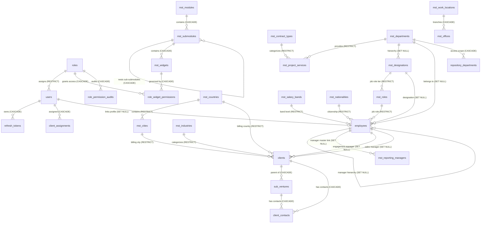

# Complete Settings & Masters Database Specification (with Cross-Module Dependencies)

This document provides the exhaustive database schema for **Settings & Masters Management** in **TrackerPro / Pulse PMO**, including all cross-module foreign key constraints, referential actions (`ON DELETE`), cascade rules, indexing strategies, and ER diagrams.

---

## 1. System Architecture & Cross-Module Dependency Map

Masters and Settings serve as the operational backbone for all modules in TrackerPro:


```mermaid
erDiagram
    %% ==========================================
    %% 1. RBAC & MODULE / WIDGET ACCESS CONTROL
    %% ==========================================
    roles ||--o{ users : "assigns (RESTRICT)"
    roles ||--o{ role_widget_permissions : "grants access (CASCADE)"
    roles ||--o{ role_permission_audits : "audits (CASCADE)"
    mst_modules ||--o{ mst_submodules : "contains (CASCADE)"
    mst_submodules ||--o{ mst_submodules : "nests sub-submodules (CASCADE)"
    mst_submodules ||--o{ mst_widgets : "contains (CASCADE)"
    mst_widgets ||--o{ role_widget_permissions : "governed by (CASCADE)"
    users ||--o{ refresh_tokens : "owns (CASCADE)"
    users ||--o{ client_assignments : "assigned (CASCADE)"
    users ||--o| employees : "links profile (SET NULL)"

    %% ==========================================
    %% 2. PROJECT MASTERS DEPENDENCIES
    %% ==========================================
    mst_contract_types ||--o{ mst_project_services : "categorizes (RESTRICT)"
    mst_departments ||--o{ mst_project_services : "provides (RESTRICT)"

    %% ==========================================
    %% 3. CUSTOMER MASTERS DEPENDENCIES
    %% ==========================================
    mst_industries ||--o{ clients : "categorizes (RESTRICT)"
    mst_countries ||--o{ mst_cities : "contains (RESTRICT)"
    mst_countries ||--o{ clients : "billing country (RESTRICT)"
    mst_cities ||--o{ clients : "billing city (RESTRICT)"
    clients ||--o{ sub_ventures : "parent of (CASCADE)"
    clients ||--o{ client_contacts : "has contacts (CASCADE)"
    sub_ventures ||--o{ client_contacts : "has contacts (CASCADE)"

    %% ==========================================
    %% 4. RESOURCE MASTERS DEPENDENCIES
    %% ==========================================
    mst_departments ||--o{ mst_designations : "hierarchy (SET NULL)"
    mst_departments ||--o{ employees : "belongs to (SET NULL)"
    mst_departments ||--o{ repository_departments : "access scope (CASCADE)"
    mst_designations ||--o{ mst_roles : "job role tier (RESTRICT)"
    mst_designations ||--o{ employees : "designation (SET NULL)"
    mst_roles ||--o{ employees : "job role (RESTRICT)"
    mst_work_locations ||--o{ mst_offices : "branches (CASCADE)"
    mst_salary_bands ||--o{ employees : "band level (RESTRICT)"
    mst_nationalities ||--o{ employees : "citizenship (RESTRICT)"
    employees ||--o{ employees : "manager hierarchy (SET NULL)"
    employees ||--o{ mst_reporting_managers : "manager master link (SET NULL)"
    employees ||--o{ clients : "engagement manager (SET NULL)"
    employees ||--o{ clients : "sales manager (SET NULL)"
```

---

## 2. Global Base Entity Audit & Soft-Delete Standards

Every table in the database includes standard audit and soft-delete columns via the `BaseEntity` contract:

| Column | Data Type | Nullable | Default | Description |
| :--- | :--- | :--- | :--- | :--- |
| `Id` | `UUID` | NO | `gen_random_uuid()` | Primary Key |
| `CreatedAtUtc` | `TIMESTAMPTZ` | NO | `now()` | Record creation timestamp |
| `UpdatedAtUtc` | `TIMESTAMPTZ` | YES | `NULL` | Timestamp of latest modification |
| `CreatedBy` | `UUID` | YES | `NULL` | Foreign key referencing `users.Id` |
| `UpdatedBy` | `UUID` | YES | `NULL` | Foreign key referencing `users.Id` |
| `DeletedAtUtc` | `TIMESTAMPTZ` | YES | `NULL` | Soft-delete flag (`NULL` = Active, Timestamp = Soft Deleted) |

---

## 3. Detailed Schemas by Domain & Module Dependencies

---

### Module 1: Security & RBAC Settings (Module → Submodule → Widget Hierarchy)

This module implements the 4-tier access control structure (**Role → Module → Submodule → Widget/Tab**) with binary **View (`1`/`0`)** and **Manage (`1`/`0`)** access levels derived from `modules RBAC.xlsx`.

#### 1.1 Architecture & Invariant Rules
- **Binary Flags**: In the database, access is controlled via `CanView` (0/1) and `CanManage` (0/1).
- **Core Invariant**: If a role has `CanManage = 1`, it **must** have `CanView = 1`. A user cannot manage an element they cannot see. This is enforced by database constraint `chk_manage_requires_view`.
- **Three UI States**:
  - `CanView = 0, CanManage = 0` $\rightarrow$ **Hidden** (element completely omitted from DOM; API returns `403 Forbidden`).
  - `CanView = 1, CanManage = 0` $\rightarrow$ **Read-Only** (element displayed; create/edit/delete/upload actions hidden or disabled).
  - `CanView = 1, CanManage = 1` $\rightarrow$ **Full Manage** (interactive buttons and write mutations permitted).

---

#### Table: `roles`
Stores application roles (system default roles + admin-created custom roles).
- **Outbound Dependencies**: Referenced by `users.RoleId` (`ON DELETE RESTRICT`), `role_widget_permissions.RoleId` (`ON DELETE CASCADE`), and `role_permission_audits.RoleId` (`ON DELETE CASCADE`).

```sql
CREATE TABLE IF NOT EXISTS roles (
    "Id" UUID PRIMARY KEY DEFAULT gen_random_uuid(),
    "Name" VARCHAR(100) NOT NULL UNIQUE,          -- Machine key: 'CEO', 'PMO', 'Testing-Manager'
    "DisplayName" VARCHAR(150) NOT NULL,        -- User-friendly: 'Testing Project Manager'
    "Description" VARCHAR(500),
    "IsSystemRole" BOOLEAN NOT NULL DEFAULT false, -- System roles cannot be deleted
    "IsActive" BOOLEAN NOT NULL DEFAULT true,
    "CreatedAtUtc" TIMESTAMPTZ NOT NULL DEFAULT now(),
    "UpdatedAtUtc" TIMESTAMPTZ,
    "CreatedBy" UUID REFERENCES users("Id") ON DELETE SET NULL,
    "UpdatedBy" UUID REFERENCES users("Id") ON DELETE SET NULL,
    "DeletedAtUtc" TIMESTAMPTZ
);

CREATE INDEX IF NOT EXISTS "IX_roles_IsActive" ON roles ("IsActive");
```

---

#### Table: `mst_modules`
Top-level application domains (e.g., Dashboard, Action Center, Projects, Reports, Resource, Customers, Repository, My Team, Settings).
- **Outbound Dependencies**: Referenced by `mst_submodules.ModuleId` (`ON DELETE CASCADE`).

```sql
CREATE TABLE IF NOT EXISTS mst_modules (
    "Id" UUID PRIMARY KEY DEFAULT gen_random_uuid(),
    "Code" VARCHAR(80) NOT NULL UNIQUE,          -- 'dashboard', 'projects', 'reports', 'resources'
    "Name" VARCHAR(150) NOT NULL,                -- 'Dashboard', 'Projects', 'Reports & Analytics'
    "Icon" VARCHAR(80),                          -- Lucide icon name: 'LayoutDashboard', 'FolderKanban'
    "SortOrder" INT NOT NULL DEFAULT 0,
    "IsActive" BOOLEAN NOT NULL DEFAULT true,
    "CreatedAtUtc" TIMESTAMPTZ NOT NULL DEFAULT now(),
    "UpdatedAtUtc" TIMESTAMPTZ,
    "CreatedBy" UUID REFERENCES users("Id") ON DELETE SET NULL,
    "UpdatedBy" UUID REFERENCES users("Id") ON DELETE SET NULL,
    "DeletedAtUtc" TIMESTAMPTZ
);

CREATE INDEX IF NOT EXISTS "IX_mst_modules_Code" ON mst_modules ("Code");
```

---

#### Table: `mst_submodules`
Submodules and Sub-submodules under a module. Supports multi-level nesting via `ParentSubmoduleId` (e.g. `Projects` $\rightarrow$ `projects Cards` $\rightarrow$ `Health`).
- **Dependencies**:
  - `ModuleId` $\rightarrow$ `mst_modules.Id` (`ON DELETE CASCADE`)
  - `ParentSubmoduleId` $\rightarrow$ `mst_submodules.Id` (`ON DELETE CASCADE`)
- **Outbound Dependencies**: Referenced by `mst_widgets.SubmoduleId` (`ON DELETE CASCADE`).

```sql
CREATE TABLE IF NOT EXISTS mst_submodules (
    "Id" UUID PRIMARY KEY DEFAULT gen_random_uuid(),
    "ModuleId" UUID NOT NULL REFERENCES mst_modules("Id") ON DELETE CASCADE,
    "ParentSubmoduleId" UUID REFERENCES mst_submodules("Id") ON DELETE CASCADE,
    "Code" VARCHAR(80) NOT NULL,                 -- 'health', 'overview', 'wbs', 'directory'
    "Name" VARCHAR(150) NOT NULL,                -- 'Health & Governance', 'Overview', 'WBS'
    "RoutePrefix" VARCHAR(150),                  -- '/projects/:id/health', '/resources/directory'
    "SortOrder" INT NOT NULL DEFAULT 0,
    "IsActive" BOOLEAN NOT NULL DEFAULT true,
    "CreatedAtUtc" TIMESTAMPTZ NOT NULL DEFAULT now(),
    "UpdatedAtUtc" TIMESTAMPTZ,
    "CreatedBy" UUID REFERENCES users("Id") ON DELETE SET NULL,
    "UpdatedBy" UUID REFERENCES users("Id") ON DELETE SET NULL,
    "DeletedAtUtc" TIMESTAMPTZ,
    CONSTRAINT "UQ_submodule_module_parent_code" UNIQUE ("ModuleId", "ParentSubmoduleId", "Code")
);

CREATE INDEX IF NOT EXISTS "IX_mst_submodules_ModuleId" ON mst_submodules ("ModuleId");
CREATE INDEX IF NOT EXISTS "IX_mst_submodules_ParentSubmoduleId" ON mst_submodules ("ParentSubmoduleId");
CREATE INDEX IF NOT EXISTS "IX_mst_submodules_Code" ON mst_submodules ("Code");
```

---

#### Table: `mst_widgets`
Granular functional units, cards, tables, action panels, or tabs governed by access control.
- **Dependencies**: `SubmoduleId` $\rightarrow$ `mst_submodules.Id` (`ON DELETE CASCADE`).
- **Outbound Dependencies**: Referenced by `role_widget_permissions.WidgetId` (`ON DELETE CASCADE`).

```sql
CREATE TABLE IF NOT EXISTS mst_widgets (
    "Id" UUID PRIMARY KEY DEFAULT gen_random_uuid(),
    "SubmoduleId" UUID NOT NULL REFERENCES mst_submodules("Id") ON DELETE CASCADE,
    "Code" VARCHAR(100) NOT NULL,                -- 'issue_tracker', 'kpis', 'budget'
    "Name" VARCHAR(150) NOT NULL,                -- 'Issue Tracker', 'KPI Summary Card'
    "WidgetKey" VARCHAR(200) NOT NULL UNIQUE,    -- Canonical key: 'projects.health.issue_tracker'
    "WidgetType" VARCHAR(40) NOT NULL DEFAULT 'widget', -- 'widget', 'tab', 'action_group', 'kpi_card', 'table'
    "HasManageAction" BOOLEAN NOT NULL DEFAULT true,    -- False for read-only items (e.g. Dashboard KPIs)
    "Description" VARCHAR(500),
    "SortOrder" INT NOT NULL DEFAULT 0,
    "IsActive" BOOLEAN NOT NULL DEFAULT true,
    "CreatedAtUtc" TIMESTAMPTZ NOT NULL DEFAULT now(),
    "UpdatedAtUtc" TIMESTAMPTZ,
    "CreatedBy" UUID REFERENCES users("Id") ON DELETE SET NULL,
    "UpdatedBy" UUID REFERENCES users("Id") ON DELETE SET NULL,
    "DeletedAtUtc" TIMESTAMPTZ,
    CONSTRAINT "UQ_widget_submodule_code" UNIQUE ("SubmoduleId", "Code")
);

CREATE INDEX IF NOT EXISTS "IX_mst_widgets_WidgetKey" ON mst_widgets ("WidgetKey");
CREATE INDEX IF NOT EXISTS "IX_mst_widgets_SubmoduleId" ON mst_widgets ("SubmoduleId");
```

---

#### Table: `role_widget_permissions` (The Core 1 / 0 Matrix)
Maps each role to every widget with explicit binary `CanView` and `CanManage` flags.
- **Dependencies**:
  - `RoleId` $\rightarrow$ `roles.Id` (`ON DELETE CASCADE`)
  - `WidgetId` $\rightarrow$ `mst_widgets.Id` (`ON DELETE CASCADE`)

```sql
CREATE TABLE IF NOT EXISTS role_widget_permissions (
    "Id" UUID PRIMARY KEY DEFAULT gen_random_uuid(),
    "RoleId" UUID NOT NULL REFERENCES roles("Id") ON DELETE CASCADE,
    "WidgetId" UUID NOT NULL REFERENCES mst_widgets("Id") ON DELETE CASCADE,
    "CanView" SMALLINT NOT NULL DEFAULT 0,       -- 1 = Can View, 0 = Hidden
    "CanManage" SMALLINT NOT NULL DEFAULT 0,     -- 1 = Can Manage/Edit, 0 = Read Only
    "CreatedAtUtc" TIMESTAMPTZ NOT NULL DEFAULT now(),
    "UpdatedAtUtc" TIMESTAMPTZ,
    "CreatedBy" UUID REFERENCES users("Id") ON DELETE SET NULL,
    "UpdatedBy" UUID REFERENCES users("Id") ON DELETE SET NULL,
    "DeletedAtUtc" TIMESTAMPTZ,

    -- Uniqueness: Exactly one permission entry per role per widget
    CONSTRAINT "UQ_role_widget_permissions" UNIQUE ("RoleId", "WidgetId"),

    -- Domain Constraints: Value must be 0 or 1
    CONSTRAINT "CHK_role_widget_can_view_binary" CHECK ("CanView" IN (0, 1)),
    CONSTRAINT "CHK_role_widget_can_manage_binary" CHECK ("CanManage" IN (0, 1)),

    -- Core Invariant: Manage implies View
    CONSTRAINT "CHK_role_widget_manage_requires_view" CHECK ("CanManage" = 0 OR "CanView" = 1)
);

CREATE INDEX IF NOT EXISTS "IX_role_widget_permissions_RoleId" ON role_widget_permissions ("RoleId");
CREATE INDEX IF NOT EXISTS "IX_role_widget_permissions_WidgetId" ON role_widget_permissions ("WidgetId");
CREATE INDEX IF NOT EXISTS "IX_role_widget_lookup" ON role_widget_permissions ("RoleId", "CanView", "CanManage");
```

---

#### Fast-Query View: `vw_role_widget_matrix`
Pre-joined materialized view for quick token generation and settings matrix rendering without deep JOIN overhead:

```sql
CREATE OR REPLACE VIEW vw_role_widget_matrix AS
SELECT 
    r."Id" AS "RoleId",
    r."Name" AS "RoleName",
    m."Code" AS "ModuleCode",
    m."Name" AS "ModuleName",
    sm."Code" AS "SubmoduleCode",
    sm."Name" AS "SubmoduleName",
    w."Id" AS "WidgetId",
    w."WidgetKey",
    w."Name" AS "WidgetName",
    w."WidgetType",
    w."HasManageAction",
    COALESCE(rwp."CanView", 0) AS "CanView",
    COALESCE(rwp."CanManage", 0) AS "CanManage"
FROM roles r
CROSS JOIN mst_widgets w
JOIN mst_submodules sm ON w."SubmoduleId" = sm."Id"
JOIN mst_modules m ON sm."ModuleId" = m."Id"
LEFT JOIN role_widget_permissions rwp 
       ON rwp."RoleId" = r."Id" AND rwp."WidgetId" = w."Id"
WHERE w."DeletedAtUtc" IS NULL 
  AND sm."DeletedAtUtc" IS NULL 
  AND m."DeletedAtUtc" IS NULL;
```

---

#### Table: `role_permission_audits`
Audit trail of granular permission changes for compliance, SOC2, and security review.
- **Dependencies**: `RoleId` $\rightarrow$ `roles.Id` (`ON DELETE CASCADE`), `ModifiedBy` $\rightarrow$ `users.Id` (`ON DELETE SET NULL`).

```sql
CREATE TABLE IF NOT EXISTS role_permission_audits (
    "Id" UUID PRIMARY KEY DEFAULT gen_random_uuid(),
    "RoleId" UUID NOT NULL REFERENCES roles("Id") ON DELETE CASCADE,
    "Action" VARCHAR(50) NOT NULL,               -- 'UPDATED', 'RESET_BASELINE', 'CLONED'
    "WidgetKey" VARCHAR(200),                    -- 'projects.health.issue_tracker' or 'ALL'
    "OldCanView" SMALLINT,
    "OldCanManage" SMALLINT,
    "NewCanView" SMALLINT,
    "NewCanManage" SMALLINT,
    "ModifiedBy" UUID REFERENCES users("Id") ON DELETE SET NULL,
    "ModifiedAtUtc" TIMESTAMPTZ NOT NULL DEFAULT now(),
    "Reason" VARCHAR(500),
    "CreatedAtUtc" TIMESTAMPTZ NOT NULL DEFAULT now(),
    "UpdatedAtUtc" TIMESTAMPTZ,
    "CreatedBy" UUID REFERENCES users("Id") ON DELETE SET NULL,
    "UpdatedBy" UUID REFERENCES users("Id") ON DELETE SET NULL,
    "DeletedAtUtc" TIMESTAMPTZ
);

CREATE INDEX IF NOT EXISTS "IX_role_permission_audits_RoleId" ON role_permission_audits ("RoleId");
CREATE INDEX IF NOT EXISTS "IX_role_permission_audits_ModifiedAtUtc" ON role_permission_audits ("ModifiedAtUtc");
```

---

#### 1.2 Master Catalog Mapping (Exhaustive 49 Leaves from `modules RBAC.xlsx`)

The following reference table defines all 49 granular feature leaves identified in `modules RBAC.xlsx`:

| # | Module | Submodule | Sub-submodule | Widget / Tab | Canonical Key (`WidgetKey`) | Has Manage? |
| :- | :--- | :--- | :--- | :--- | :--- | :---: |
| 1 | **Dashboard** | — | — | KPI'S | `dashboard.kpis` | ❌ (View only) |
| 2 | **Dashboard** | — | — | Assigned Projects | `dashboard.assigned_projects` | ❌ (View only) |
| 3 | **Dashboard** | — | — | Pending Issues | `dashboard.pending_issues` | ❌ (View only) |
| 4 | **Dashboard** | — | — | Project Status | `dashboard.project_status` | ❌ (View only) |
| 5 | **Dashboard** | — | — | Pending Approvals | `dashboard.pending_approvals` | ❌ (View only) |
| 6 | **Action Center**| Bucket List | — | Raise Issues | `action_center.bucket_list.raise_issues` | ✅ |
| 7 | **Action Center**| Bucket List | — | Start Timer | `action_center.bucket_list.start_timer` | ✅ |
| 8 | **Action Center**| Approvals | — | Approvals Queue | `action_center.approvals` | ✅ |
| 9 | **Action Center**| Alerts | — | Alerts Feed | `action_center.alerts` | ✅ |
| 10 | **Action Center**| Notifications | — | Notification Feed | `action_center.notifications` | ✅ |
| 11 | **Projects** | projects Cards | Overview | Budget | `projects.overview.budget` | ✅ |
| 12 | **Projects** | projects Cards | Overview | Extension Request | `projects.overview.extension_request` | ✅ |
| 13 | **Projects** | projects Cards | Overview | Sr. Project Manager | `projects.overview.assign_spm` | ✅ |
| 14 | **Projects** | projects Cards | Overview | Project Manager | `projects.overview.assign_pm` | ✅ |
| 15 | **Projects** | projects Cards | Overview | Team Leads | `projects.overview.assign_tl` | ✅ |
| 16 | **Projects** | projects Cards | WBS | Billing Information | `projects.wbs.billing_info` | ✅ |
| 17 | **Projects** | projects Cards | WBS | PMO Intake & Prerequisite | `projects.wbs.pmo_intake` | ✅ |
| 18 | **Projects** | projects Cards | WBS | Invoice Schedule | `projects.wbs.invoice_schedule` | ✅ |
| 19 | **Projects** | projects Cards | Team | Team Allocation | `projects.team.allocation` | ✅ |
| 20 | **Projects** | projects Cards | Task | Task Breakdown | `projects.task.management` | ✅ |
| 21 | **Projects** | projects Cards | Health | Issues | `projects.health.issues` | ✅ |
| 22 | **Projects** | projects Cards | Health | Alerts | `projects.health.alerts` | ✅ |
| 23 | **Projects** | projects Cards | Health | Escalation | `projects.health.escalation` | ✅ |
| 24 | **Projects** | projects Cards | Health | Appreciation | `projects.health.appreciation` | ✅ |
| 25 | **Projects** | projects Cards | Health | Customer Engagement > Interview | `projects.health.engagement.interview` | ✅ |
| 26 | **Projects** | projects Cards | Health | Customer Engagement > Requirements | `projects.health.engagement.requirements` | ✅ |
| 27 | **Projects** | projects Cards | Invoice | Invoicing Grid | `projects.invoice.management` | ✅ |
| 28 | **Reports** | Sales Report | — | Sales Reports | `reports.sales` | ✅ |
| 29 | **Reports** | WBS Tracker | — | WBS Tracker | `reports.wbs_tracker` | ✅ |
| 30 | **Reports** | PO Tracker | — | PO Tracker | `reports.po_tracker` | ✅ |
| 31 | **Reports** | Invoice Tracker| — | Invoice Tracker | `reports.invoice_tracker` | ✅ |
| 32 | **Resource** | Directory | Resource Details | Personal Information | `resources.directory.personal_info` | ✅ |
| 33 | **Resource** | Directory | Resource Details | Organization Details | `resources.directory.org_details` | ✅ |
| 34 | **Resource** | Directory | Resource Details | Employment & Bond | `resources.directory.employment_bond` | ✅ |
| 35 | **Resource** | Directory | Resource Details | Education & Experience | `resources.directory.education_exp` | ✅ |
| 36 | **Resource** | Directory | Resource Details | PMO Information | `resources.directory.pmo_info` | ✅ |
| 37 | **Resource** | Directory | Resource Details | Activity Logs | `resources.directory.activity_logs` | ❌ (View only) |
| 38 | **Resource** | Resource Pool | — | Resource Pool Pool Grid | `resources.resource_pool` | ✅ |
| 39 | **Resource** | Exit Summary | — | Exit Summary Logs | `resources.exit_summary` | ✅ |
| 40 | **Customers** | Customers Card| Customer Profile | Customer Profiles | `customers.customer_profile` | ✅ |
| 41 | **Repository** | — | — | Document Repository | `repository.documents` | ✅ |
| 42 | **My Team** | Team Dashboard| — | Team Roster & KPIs | `my_team.dashboard` | ✅ |
| 43 | **My Team** | Timesheets | My Timesheet | Personal Timesheet Grid | `my_team.my_timesheet` | ✅ |
| 44 | **My Team** | Timesheets | Timesheet Approval | Timesheet Approvals Grid | `my_team.timesheet_approval` | ✅ |
| 45 | **Settings** | Roles & Perm | Moduleswise Access | Module Access Matrix | `settings.roles.modules_access` | ✅ |
| 46 | **Settings** | Roles & Perm | User Role Access | User Role Assignments | `settings.roles.user_access` | ✅ |
| 47 | **Settings** | Masters | Project Masters | Project Masters Grid | `settings.masters.project` | ✅ |
| 48 | **Settings** | Masters | Customer Masters | Customer Masters Grid | `settings.masters.customer` | ✅ |
| 49 | **Settings** | Masters | Resource Master | Resource Masters Grid | `settings.masters.resource` | ✅ |

---

### Module 2: Project Masters & Deliverable Catalog

#### Table: `mst_contract_types`
Commercial contract models (e.g., Time & Materials, Fixed Bid, Scope Based, Retainer).
- **Outbound Dependencies**: Referenced by `mst_project_services.ContractTypeId` (`ON DELETE RESTRICT`).

```sql
CREATE TABLE IF NOT EXISTS mst_contract_types (
    "Id" UUID PRIMARY KEY DEFAULT gen_random_uuid(),
    "Code" VARCHAR(80) NOT NULL UNIQUE,
    "Name" VARCHAR(150) NOT NULL UNIQUE,
    "Description" VARCHAR(500),
    "IsActive" BOOLEAN NOT NULL DEFAULT true,
    "SortOrder" INT NOT NULL DEFAULT 0,
    "CreatedAtUtc" TIMESTAMPTZ NOT NULL DEFAULT now(),
    "UpdatedAtUtc" TIMESTAMPTZ,
    "CreatedBy" UUID REFERENCES users("Id") ON DELETE SET NULL,
    "UpdatedBy" UUID REFERENCES users("Id") ON DELETE SET NULL,
    "DeletedAtUtc" TIMESTAMPTZ
);
```

#### Table: `mst_project_services`
Project deliverable catalog mapping department offerings, toolstacks, expected durations, and billing rates.
- **Dependencies**:
  - `ContractTypeId` $\rightarrow$ `mst_contract_types.Id` (`ON DELETE RESTRICT`)
  - `DepartmentId` $\rightarrow$ `mst_departments.Id` (`ON DELETE RESTRICT`)

```sql
CREATE TABLE IF NOT EXISTS mst_project_services (
    "Id" UUID PRIMARY KEY DEFAULT gen_random_uuid(),
    "ContractTypeId" UUID REFERENCES mst_contract_types("Id") ON DELETE RESTRICT,
    "DepartmentId" UUID NOT NULL REFERENCES mst_departments("Id") ON DELETE RESTRICT,
    "ServiceName" VARCHAR(200) NOT NULL,
    "Tools" VARCHAR(300),
    "Duration" VARCHAR(100),
    "StandardDurationDays" INT,
    "UnitPrice" NUMERIC(14, 2) NOT NULL DEFAULT 0.00,
    "Currency" VARCHAR(10) NOT NULL DEFAULT 'USD',
    "IsActive" BOOLEAN NOT NULL DEFAULT true,
    "CreatedAtUtc" TIMESTAMPTZ NOT NULL DEFAULT now(),
    "UpdatedAtUtc" TIMESTAMPTZ,
    "CreatedBy" UUID REFERENCES users("Id") ON DELETE SET NULL,
    "UpdatedBy" UUID REFERENCES users("Id") ON DELETE SET NULL,
    "DeletedAtUtc" TIMESTAMPTZ
);

CREATE UNIQUE INDEX IF NOT EXISTS "IX_mst_project_services_Unique" 
ON mst_project_services ("ContractTypeId", "DepartmentId", "ServiceName") 
WHERE "DeletedAtUtc" IS NULL;
```

---

### Module 3: Customer & Geographical Masters

#### Table: `mst_industries`
Business domain classification for clients.
- **Outbound Dependencies**: Referenced by `clients.IndustryId` (`ON DELETE RESTRICT`).

```sql
CREATE TABLE IF NOT EXISTS mst_industries (
    "Id" UUID PRIMARY KEY DEFAULT gen_random_uuid(),
    "Code" VARCHAR(80) NOT NULL UNIQUE,
    "Name" VARCHAR(150) NOT NULL UNIQUE,
    "IsActive" BOOLEAN NOT NULL DEFAULT true,
    "CreatedAtUtc" TIMESTAMPTZ NOT NULL DEFAULT now(),
    "UpdatedAtUtc" TIMESTAMPTZ,
    "CreatedBy" UUID REFERENCES users("Id") ON DELETE SET NULL,
    "UpdatedBy" UUID REFERENCES users("Id") ON DELETE SET NULL,
    "DeletedAtUtc" TIMESTAMPTZ
);
```

#### Table: `mst_countries`
Global country directory with ISO codes and currency symbols.
- **Outbound Dependencies**: Referenced by `mst_cities.CountryId` (`ON DELETE RESTRICT`), `clients.CountryId` (`ON DELETE RESTRICT`), `employees.NationalityId` (`ON DELETE RESTRICT`).

```sql
CREATE TABLE IF NOT EXISTS mst_countries (
    "Id" UUID PRIMARY KEY DEFAULT gen_random_uuid(),
    "Code" VARCHAR(80) NOT NULL UNIQUE,
    "Name" VARCHAR(150) NOT NULL UNIQUE,
    "Iso2" VARCHAR(2),
    "Iso3" VARCHAR(3),
    "PhoneCode" VARCHAR(10),
    "Currency" VARCHAR(10),
    "IsActive" BOOLEAN NOT NULL DEFAULT true,
    "CreatedAtUtc" TIMESTAMPTZ NOT NULL DEFAULT now(),
    "UpdatedAtUtc" TIMESTAMPTZ,
    "CreatedBy" UUID REFERENCES users("Id") ON DELETE SET NULL,
    "UpdatedBy" UUID REFERENCES users("Id") ON DELETE SET NULL,
    "DeletedAtUtc" TIMESTAMPTZ
);
```

#### Table: `mst_cities`
City directory linked to sovereign country masters.
- **Dependencies**: `CountryId` $\rightarrow$ `mst_countries.Id` (`ON DELETE RESTRICT`).
- **Outbound Dependencies**: Referenced by `clients.CityId` (`ON DELETE RESTRICT`).

```sql
CREATE TABLE IF NOT EXISTS mst_cities (
    "Id" UUID PRIMARY KEY DEFAULT gen_random_uuid(),
    "Code" VARCHAR(80) NOT NULL,
    "Name" VARCHAR(150) NOT NULL,
    "CountryId" UUID NOT NULL REFERENCES mst_countries("Id") ON DELETE RESTRICT,
    "IsActive" BOOLEAN NOT NULL DEFAULT true,
    "CreatedAtUtc" TIMESTAMPTZ NOT NULL DEFAULT now(),
    "UpdatedAtUtc" TIMESTAMPTZ,
    "CreatedBy" UUID REFERENCES users("Id") ON DELETE SET NULL,
    "UpdatedBy" UUID REFERENCES users("Id") ON DELETE SET NULL,
    "DeletedAtUtc" TIMESTAMPTZ
);

CREATE INDEX IF NOT EXISTS "IX_mst_cities_CountryId" ON mst_cities ("CountryId");
```

#### Table: `mst_contact_types`
Stakeholder classification (e.g., Primary Contact, Billing Lead, Escalation POC).
- **Outbound Dependencies**: Referenced by `client_contacts.ContactType`.

```sql
CREATE TABLE IF NOT EXISTS mst_contact_types (
    "Id" UUID PRIMARY KEY DEFAULT gen_random_uuid(),
    "Code" VARCHAR(80) NOT NULL UNIQUE,
    "Name" VARCHAR(150) NOT NULL UNIQUE,
    "Description" VARCHAR(500),
    "IsActive" BOOLEAN NOT NULL DEFAULT true,
    "CreatedAtUtc" TIMESTAMPTZ NOT NULL DEFAULT now(),
    "UpdatedAtUtc" TIMESTAMPTZ,
    "CreatedBy" UUID REFERENCES users("Id") ON DELETE SET NULL,
    "UpdatedBy" UUID REFERENCES users("Id") ON DELETE SET NULL,
    "DeletedAtUtc" TIMESTAMPTZ
);
```

---

### Module 4: Resource & Organization Masters

#### Table: `mst_departments`
Organizational business and delivery units.
- **Outbound Dependencies**:
  - `mst_designations.DepartmentId` (`ON DELETE SET NULL`)
  - `employees.DepartmentId` (`ON DELETE SET NULL`)
  - `mst_project_services.DepartmentId` (`ON DELETE RESTRICT`)
  - `repository_departments.DepartmentId` (`ON DELETE CASCADE`)

```sql
CREATE TABLE IF NOT EXISTS mst_departments (
    "Id" UUID PRIMARY KEY DEFAULT gen_random_uuid(),
    "Code" VARCHAR(50) NOT NULL UNIQUE,
    "Name" VARCHAR(150) NOT NULL UNIQUE,
    "IsActive" BOOLEAN NOT NULL DEFAULT true,
    "CreatedAtUtc" TIMESTAMPTZ NOT NULL DEFAULT now(),
    "UpdatedAtUtc" TIMESTAMPTZ,
    "CreatedBy" UUID REFERENCES users("Id") ON DELETE SET NULL,
    "UpdatedBy" UUID REFERENCES users("Id") ON DELETE SET NULL,
    "DeletedAtUtc" TIMESTAMPTZ
);
```

#### Table: `mst_designations`
Official job designations hierarchy mapped to departments.
- **Dependencies**: `DepartmentId` $\rightarrow$ `mst_departments.Id` (`ON DELETE SET NULL`).
- **Outbound Dependencies**: `mst_roles.DesignationId` (`ON DELETE RESTRICT`), `employees.DesignationId` (`ON DELETE SET NULL`).

```sql
CREATE TABLE IF NOT EXISTS mst_designations (
    "Id" UUID PRIMARY KEY DEFAULT gen_random_uuid(),
    "Code" VARCHAR(80) NOT NULL UNIQUE,
    "Name" VARCHAR(150) NOT NULL,
    "DepartmentId" UUID REFERENCES mst_departments("Id") ON DELETE SET NULL,
    "IsActive" BOOLEAN NOT NULL DEFAULT true,
    "CreatedAtUtc" TIMESTAMPTZ NOT NULL DEFAULT now(),
    "UpdatedAtUtc" TIMESTAMPTZ,
    "CreatedBy" UUID REFERENCES users("Id") ON DELETE SET NULL,
    "UpdatedBy" UUID REFERENCES users("Id") ON DELETE SET NULL,
    "DeletedAtUtc" TIMESTAMPTZ
);

CREATE INDEX IF NOT EXISTS "IX_mst_designations_DepartmentId" ON mst_designations ("DepartmentId");
```

#### Table: `mst_roles` (Job Roles)
Granular job role matrix categorized under parent designations.
- **Dependencies**: `DesignationId` $\rightarrow$ `mst_designations.Id` (`ON DELETE RESTRICT`).
- **Outbound Dependencies**: `employees.JobRoleId` (`ON DELETE RESTRICT`).

```sql
CREATE TABLE IF NOT EXISTS mst_roles (
    "Id" UUID PRIMARY KEY DEFAULT gen_random_uuid(),
    "Code" VARCHAR(80) NOT NULL UNIQUE,
    "Name" VARCHAR(150) NOT NULL,
    "DesignationId" UUID NOT NULL REFERENCES mst_designations("Id") ON DELETE RESTRICT,
    "IsActive" BOOLEAN NOT NULL DEFAULT true,
    "CreatedAtUtc" TIMESTAMPTZ NOT NULL DEFAULT now(),
    "UpdatedAtUtc" TIMESTAMPTZ,
    "CreatedBy" UUID REFERENCES users("Id") ON DELETE SET NULL,
    "UpdatedBy" UUID REFERENCES users("Id") ON DELETE SET NULL,
    "DeletedAtUtc" TIMESTAMPTZ
);

CREATE INDEX IF NOT EXISTS "IX_mst_roles_DesignationId" ON mst_roles ("DesignationId");
```

#### Table: `mst_work_locations` & `mst_offices`
Physical branches and regional office infrastructure.
- **Dependencies**: `mst_offices.WorkLocationId` $\rightarrow$ `mst_work_locations.Id` (`ON DELETE CASCADE`).

```sql
CREATE TABLE IF NOT EXISTS mst_work_locations (
    "Id" UUID PRIMARY KEY DEFAULT gen_random_uuid(),
    "Code" VARCHAR(80) NOT NULL UNIQUE,
    "Name" VARCHAR(150) NOT NULL,
    "SortOrder" INT NOT NULL DEFAULT 0,
    "IsActive" BOOLEAN NOT NULL DEFAULT true,
    "CreatedAtUtc" TIMESTAMPTZ NOT NULL DEFAULT now(),
    "UpdatedAtUtc" TIMESTAMPTZ,
    "CreatedBy" UUID REFERENCES users("Id") ON DELETE SET NULL,
    "UpdatedBy" UUID REFERENCES users("Id") ON DELETE SET NULL,
    "DeletedAtUtc" TIMESTAMPTZ
);

CREATE TABLE IF NOT EXISTS mst_offices (
    "Id" UUID PRIMARY KEY DEFAULT gen_random_uuid(),
    "Code" VARCHAR(80) NOT NULL UNIQUE,
    "Name" VARCHAR(150) NOT NULL,
    "WorkLocationId" UUID REFERENCES mst_work_locations("Id") ON DELETE CASCADE,
    "SortOrder" INT NOT NULL DEFAULT 0,
    "IsActive" BOOLEAN NOT NULL DEFAULT true,
    "CreatedAtUtc" TIMESTAMPTZ NOT NULL DEFAULT now(),
    "UpdatedAtUtc" TIMESTAMPTZ,
    "CreatedBy" UUID REFERENCES users("Id") ON DELETE SET NULL,
    "UpdatedBy" UUID REFERENCES users("Id") ON DELETE SET NULL,
    "DeletedAtUtc" TIMESTAMPTZ
);

CREATE INDEX IF NOT EXISTS "IX_mst_offices_WorkLocationId" ON mst_offices ("WorkLocationId");
```

#### Table: `mst_salary_bands`
Internal pay and compensation grade levels.
- **Outbound Dependencies**: Referenced by `employees.SalaryBandId` (`ON DELETE RESTRICT`).

```sql
CREATE TABLE IF NOT EXISTS mst_salary_bands (
    "Id" UUID PRIMARY KEY DEFAULT gen_random_uuid(),
    "Band" VARCHAR(40) NOT NULL UNIQUE,
    "MinSalary" NUMERIC(14, 2) NOT NULL,
    "MaxSalary" NUMERIC(14, 2) NOT NULL,
    "Currency" VARCHAR(10) NOT NULL DEFAULT 'INR',
    "IsActive" BOOLEAN NOT NULL DEFAULT true,
    "CreatedAtUtc" TIMESTAMPTZ NOT NULL DEFAULT now(),
    "UpdatedAtUtc" TIMESTAMPTZ,
    "CreatedBy" UUID REFERENCES users("Id") ON DELETE SET NULL,
    "UpdatedBy" UUID REFERENCES users("Id") ON DELETE SET NULL,
    "DeletedAtUtc" TIMESTAMPTZ
);
```

#### Table: `mst_email_domains`
Allowed enterprise domain list for staff registration and customer domain verification.

```sql
CREATE TABLE IF NOT EXISTS mst_email_domains (
    "Id" UUID PRIMARY KEY DEFAULT gen_random_uuid(),
    "Domain" VARCHAR(150) NOT NULL UNIQUE,
    "IsAllowed" BOOLEAN NOT NULL DEFAULT true,
    "IsCompanyDomain" BOOLEAN NOT NULL DEFAULT true,
    "IsActive" BOOLEAN NOT NULL DEFAULT true,
    "CreatedAtUtc" TIMESTAMPTZ NOT NULL DEFAULT now(),
    "UpdatedAtUtc" TIMESTAMPTZ,
    "CreatedBy" UUID REFERENCES users("Id") ON DELETE SET NULL,
    "UpdatedBy" UUID REFERENCES users("Id") ON DELETE SET NULL,
    "DeletedAtUtc" TIMESTAMPTZ
);
```

#### Tables: `mst_certifications`, `mst_graduation_degrees`, `mst_post_graduation_degrees`
Educational qualifications and industry certifications directory.

```sql
CREATE TABLE IF NOT EXISTS mst_certifications (
    "Id" UUID PRIMARY KEY DEFAULT gen_random_uuid(),
    "Code" VARCHAR(100) NOT NULL UNIQUE,
    "Name" VARCHAR(200) NOT NULL,
    "IsActive" BOOLEAN NOT NULL DEFAULT true,
    "CreatedAtUtc" TIMESTAMPTZ NOT NULL DEFAULT now(),
    "UpdatedAtUtc" TIMESTAMPTZ,
    "CreatedBy" UUID REFERENCES users("Id") ON DELETE SET NULL,
    "UpdatedBy" UUID REFERENCES users("Id") ON DELETE SET NULL,
    "DeletedAtUtc" TIMESTAMPTZ
);

CREATE TABLE IF NOT EXISTS mst_graduation_degrees (
    "Id" UUID PRIMARY KEY DEFAULT gen_random_uuid(),
    "Code" VARCHAR(100) NOT NULL UNIQUE,
    "Name" VARCHAR(200) NOT NULL,
    "IsActive" BOOLEAN NOT NULL DEFAULT true,
    "CreatedAtUtc" TIMESTAMPTZ NOT NULL DEFAULT now(),
    "UpdatedAtUtc" TIMESTAMPTZ,
    "CreatedBy" UUID REFERENCES users("Id") ON DELETE SET NULL,
    "UpdatedBy" UUID REFERENCES users("Id") ON DELETE SET NULL,
    "DeletedAtUtc" TIMESTAMPTZ
);

CREATE TABLE IF NOT EXISTS mst_post_graduation_degrees (
    "Id" UUID PRIMARY KEY DEFAULT gen_random_uuid(),
    "Code" VARCHAR(100) NOT NULL UNIQUE,
    "Name" VARCHAR(200) NOT NULL,
    "IsActive" BOOLEAN NOT NULL DEFAULT true,
    "CreatedAtUtc" TIMESTAMPTZ NOT NULL DEFAULT now(),
    "UpdatedAtUtc" TIMESTAMPTZ,
    "CreatedBy" UUID REFERENCES users("Id") ON DELETE SET NULL,
    "UpdatedBy" UUID REFERENCES users("Id") ON DELETE SET NULL,
    "DeletedAtUtc" TIMESTAMPTZ
);
```

---

### Module 5: Global System Configuration (`app_settings`)

General key-value configuration table for global application parameters (timesheet approval rules, company branding, security policies).

```sql
CREATE TABLE IF NOT EXISTS app_settings (
    "Id" UUID PRIMARY KEY DEFAULT gen_random_uuid(),
    "Category" VARCHAR(80) NOT NULL,             -- 'Timesheet', 'Financial', 'Security', 'Branding'
    "Key" VARCHAR(120) NOT NULL UNIQUE,          -- 'Timesheet.WeeklyLockDay', 'Financial.DefaultCurrency'
    "Value" TEXT NOT NULL,                       -- Stored configuration or JSON payload
    "ValueType" VARCHAR(30) NOT NULL DEFAULT 'String', -- 'String', 'Number', 'Boolean', 'Json'
    "Description" VARCHAR(500),
    "IsEncrypted" BOOLEAN NOT NULL DEFAULT false, -- True if sensitive/encrypted secret
    "IsSystem" BOOLEAN NOT NULL DEFAULT false,    -- System defaults cannot be deleted
    "CreatedAtUtc" TIMESTAMPTZ NOT NULL DEFAULT now(),
    "UpdatedAtUtc" TIMESTAMPTZ,
    "CreatedBy" UUID REFERENCES users("Id") ON DELETE SET NULL,
    "UpdatedBy" UUID REFERENCES users("Id") ON DELETE SET NULL,
    "DeletedAtUtc" TIMESTAMPTZ
);

CREATE INDEX IF NOT EXISTS "IX_app_settings_Category" ON app_settings ("Category");
```

---

## 4. Master Dependency Matrix & Referential Actions Table

| Source Table (Master) | Dependent Table | Foreign Key Column | On Delete Action | Purpose / Effect |
| :--- | :--- | :--- | :--- | :--- |
| **`roles`** | `users` | `RoleId` | `RESTRICT` | Prevents deleting a role assigned to active users |
| **`roles`** | `role_widget_permissions` | `RoleId` | `CASCADE` | Clears permissions when a role is removed |
| **`roles`** | `role_permission_audits` | `RoleId` | `CASCADE` | Purges audit trail if a custom role is removed |
| **`mst_modules`** | `mst_submodules` | `ModuleId` | `CASCADE` | Removing a module cascades to its submodules |
| **`mst_submodules`** | `mst_submodules` | `ParentSubmoduleId`| `CASCADE` | Removing a submodule cascades to child sub-submodules |
| **`mst_submodules`** | `mst_widgets` | `SubmoduleId` | `CASCADE` | Removing a submodule cascades to its widgets |
| **`mst_widgets`** | `role_widget_permissions` | `WidgetId` | `CASCADE` | Removing a widget clears its role access rules |
| **`mst_departments`** | `mst_designations` | `DepartmentId` | `SET NULL` | Preserves designation title if department is deleted |
| **`mst_departments`** | `employees` | `DepartmentId` | `SET NULL` | Employee record remains intact if dept is removed |
| **`mst_departments`** | `mst_project_services`| `DepartmentId` | `RESTRICT` | Protects department active deliverable mappings |
| **`mst_departments`** | `repository_departments`| `DepartmentId` | `CASCADE` | Clears department tag from document repository |
| **`mst_designations`** | `mst_roles` | `DesignationId` | `RESTRICT` | Maintains job role hierarchy |
| **`mst_designations`** | `employees` | `DesignationId` | `SET NULL` | Preserves employee profile |
| **`mst_roles`** | `employees` | `JobRoleId` | `RESTRICT` | Ensures employee always has a valid job role tier |
| **`mst_countries`** | `mst_cities` | `CountryId` | `RESTRICT` | Preserves geographical city-country integrity |
| **`mst_countries`** | `clients` | `CountryId` | `RESTRICT` | Prevents deletion of country actively billed to clients |
| **`mst_cities`** | `clients` | `CityId` | `RESTRICT` | Protects operational delivery city links |
| **`mst_industries`** | `clients` | `IndustryId` | `RESTRICT` | Protects client industry sector classifications |
| **`mst_contract_types`**| `mst_project_services`| `ContractTypeId`| `RESTRICT` | Protects deliverable catalog pricing rules |
| **`mst_work_locations`**| `mst_offices` | `WorkLocationId` | `CASCADE` | Deleting a location cascades to its branch offices |
| **`mst_salary_bands`** | `employees` | `SalaryBandId` | `RESTRICT` | Prevents deleting salary bands assigned to employees |
| **`employees`** | `clients` | `EngagementManagerId` | `SET NULL`| Leaves client active if manager departs |
| **`employees`** | `clients` | `SalesManagerId` | `SET NULL`| Leaves client active if sales manager departs |
| **`employees`** | `employees` | `ReportingManagerId` | `SET NULL`| Prevents broken manager chains |
| **`users`** | *All Masters* | `CreatedBy` / `UpdatedBy` | `SET NULL` | Audit columns remain populated or null on user removal |
